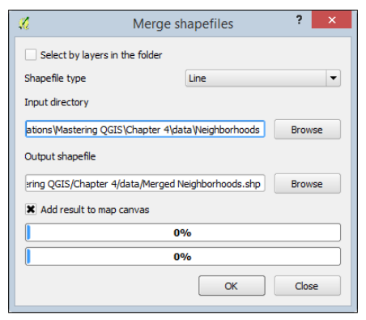
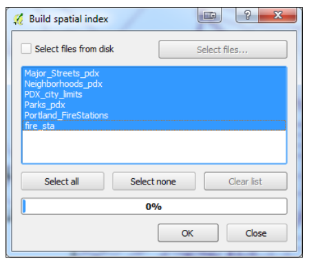
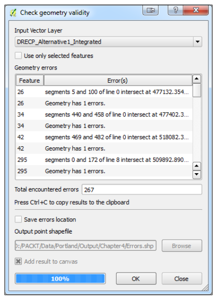
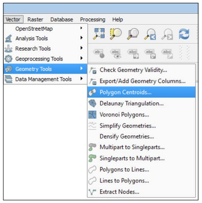
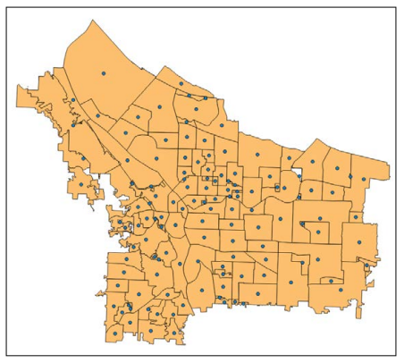
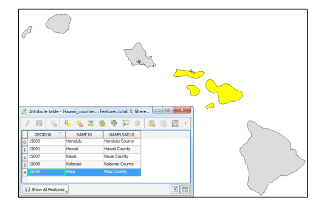
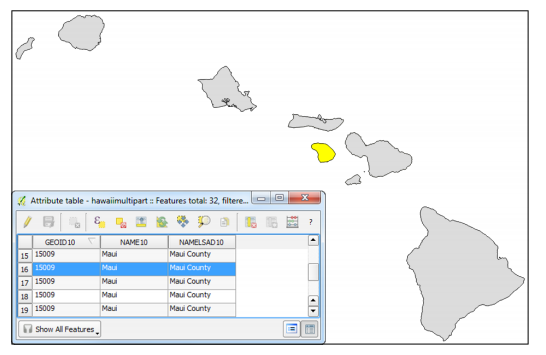
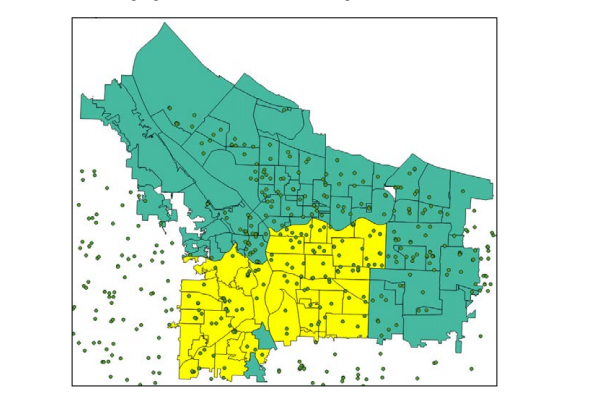
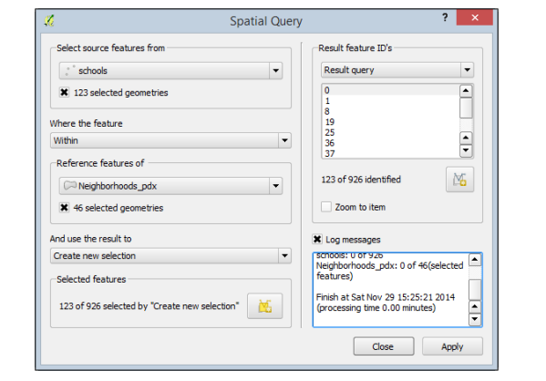

# Chapter 4: Preparing Vector Data for Processing

Typically, raw data obtained for a GIS project needs to be massaged for use in the specifi application.  
It may need to be __merged, converted to a different geometry type, saved to the coordinate reference system of the project, subset to the extent of the study area, or subset by attribute values.__  
While QGIS provides a powerful set of tools that can handle many types of vector preparation and transformation tasks, this chapter will cover what we consider to be commonly used vector-preparation tasks.  
Many of the tools covered in this chapter are found on the __Vector menu__ in QGIS; however, others are available in the __processing toolbox__.  
Additional vector processing tasks will be covered in Chapter 7, The Processing Toolbox and Chapter 8, Automating Workflws with the Graphical Modeler.  
The topics that we will cover in this chapter are as follows:   


* __Merging shapefiles__  
* Creating spatial indices  
* Checking for geometry errors  
* Converting vector geometries  
* Adding geometry columns  
* Using basic vector geoprocessing tools  
* Advanced fild calculations  
* Complex spatial and aspatial queries  
* Defining new coordinate reference systems  
* Raster to vector format conversions  

## 4.1 Merging shapefiles

The Merge Shapefies to One tool merges (that is, combines) multiple input shapefies to a new shapefie.  
The input shapefies must be in a common coordinate reference system and should contain common attributes.  
For example, vector data is often provided in tiles or by political jurisdiction such as counties or states.  
In these cases, the data may need to be merged to form a seamless layer covering the study area.  
The __Merge Shapefies to One__ tool that can be found by navigating to __Vector | Data Management Tools__ will combine them.  
  




In the Merge shapefies dialog, you have the option to choose whether you wish to merge all shapefies in a folder or pick individual shapefies to merge.  
1. Depending on how your shapefies are stored, you can do either of the following:  
  * Keep Select by layers in the folder unchecked to merge all shapefiles in a directory  
  * Check Select by layers in the folder to select individual files to merge  
2. If the previous option is enabled, choose the shapefie type (Point, Line, or Polygon).  
3. Set the input directory/fies by clicking on Browse.  
4. Name the output shapefie by clicking on Browse.  
5. Choose whether you wish to select Add result to map canvas.  
6. Click on OK to merge the shapefies.  


## 4.2 Creating spatial indices

Large data layers with hundreds or thousands of features will render much more quickly with a spatial index.  
To create a spatial index, choose the __Create Spatial Index tool__ by navigating to __Vector | Data Management Tools__.  
Select the loaded canvas layers or check the __Select fies from disk__ option and navigate to a folder and select layers on disk.  
Click on __OK__ to create the spatial indexes.  
  




## 4.3 Checking for geometry errors

Data (even from reputable sources) can contain geometry errors.  
These can often be tiny geometry errors that are not obvious but that prevent geoprocessing tools from running or producing valid results.  
  
The Check Geometry Validity tool (which can be found by navigating to Vector | Geometry Tools | Check Geometry Validity) takes an input vector layer that is loaded in the canvas and scans the data for errors, such as geometric intersections.  
The errors can be displayed in a window on the tool or can be output to a point layer.  
The resulting point layer will have an attribute describing the error.  
In the following screenshot, you can see that the tool has been run using the DRECP_Alternative1_ Integrated.shp sample dataset.  
This data is portion one of fie alternatives for the Desert Renewable Energy Conservation Plan for Southern California.  
The tool found 267 errors.  
The errors still need to be repaired, but at least you now know where they are!   




> If you have a layer with hundreds or thousands of errors, the most elegant way to repair them is to use the GRASS GIS plugin to import them into a GRASS database.  
GRASS uses a topological vector data model.  
When importing, you can set a snapping tolerance below which vertices will be snapped together.  
This will likely clean up the majority of the errors.  
For the remainder, you can use the v.clean GRASS tool.  
Once the errors have been cleaned up, the data can be exported out of GRASS into the vector format that you require.  


## 4.4 Converting vector geometries

Sometimes, it is necessary to __make conversions among point, line, and polygon vector geometries.__  
For example, you may need to generate point centroids from zip code polygons or a town boundary polygon from a line layer.  
Such conversions may be necessary to put the data into the most appropriate geometry for analysis.  
For example, if you need to determine the acreage of parcels, but they are provided in a line format, you will need to convert them to polygons to calculate their areas.  
Sometimes, you may want to convert geometries for cartographic reasons, such as converting polygons to points to create label points.  
The following tools can be found on the __Geometry Tools__ menu under __Vector__:   




### 4.4.1 Creating polygon centroids

With the Polygon Centroids tool that can be found by navigating to __Vector | Geometry Tools__, you can generate points that will be located at the center of polygons.  
Simply provide the input polygon layer and name the output.  
In the following example, centroids of the Neighborhoods_pdx.shp shapefie have been generated.  
This tool preserves all the attributes during the conversion.  
With the data in point form, you can generate a heat map, compute densities, or measure distances.  
  




### 4.4.2 Converting polygons to lines and lines to polygons


```python

```

### 4.4.3 Creating polygons surrounding individual points


```python

```

### 4.4.4 Extracting nodes from lines and polygons

The Extract Nodes tool (which can found by navigating to __Vector | Geometry Tools | Extract Nodes__) can be used to convert either line or polygon layers into a point layer.  
Each individual vertex from the input layer will be extracted and output to a new layer.  
In the following example, we are interested in identifying street intersections.  
By extracting the nodes from the Selected_streets.shp layer, a point for each intersection is generated, as shown in the following screenshot:   
  


### 4.4.5 Simplifying and densifying features

The Simplify Geometries and Densify Geometries tools (which can found by navigating to Vector | Geometry Tools) remove and add vertices, respectively.  
They are only suitable for line and polygon data.  
  
Simplifying data may be desirable to make it more suitable for use at a smaller scale.  
It may also be helpful if the data is to be used in an online interactive mapping scenario.  
The simplify tool uses a modifid Douglas-Peucker algorithm that reduces the number of vertices while attempting to maintain the shape of the features.  
In the following example, the polygons of the Neighborhoods_pdx.shp data are simplifid with a simplify tolerance of 20.  
The tolerance is specifid in map units.  


### 4.4.6 Converting between multipart and singlepart features

In a typical vector layer, one feature corresponds to one record in the attribute table.  
In a multipart layer, there are multiple features that are tied to one record in the attribute table.  
This is often the case with data representing islands.  
For example, we have some sample data of county boundaries for Hawaii.  
Hawaii has fie counties and the GIS data has fie records in the attribute table.  
However, several of these counties include multiple islands.  
  
  
To illustrate this point, the following fiure shows a single record selected in the attribute table that selects multiple polygons that are tied to the single record:   
  



  
Using the __Multipart to Singleparts tool__, which can be found by navigating to __Vector | Geometry Tools__, with Hawaii_counties.shp as the input, we generate a singlepart shapefie with 32 features.  
The following fiure shows that __a single polygon is now tied to a single record in the attribute table__:   
  
  



The __Singleparts to Multipart tool__, which can be found by navigating to __Vector | Geometry Tools__, generates a multipart layer based on an attribute you specify in the Unique ID fild input.  
The options of the Singleparts to Multipart tool are shown in the following screenshot:   

### 4.4.7 Adding geometry columns to attribute table

To add geometry values to new attribute columns in a vector layer's attribute table, click on __Export/Add Geometry Columns__ by navigating to __Vector | Geometry Tools__.  
As shown in the following screenshot, the tool requires an input vector layer, a determination of which CRS will be used for the calculations (Calculate using), and a choice of whether you wish to create the columns in the existing fie or Save to new shapefie with the added geometry columns:   


To add geometry values to new attribute columns in a vector layer's attribute table, click on Export/Add Geometry Columns by navigating to Vector | Geometry Tools.    
As shown in the following screenshot, the tool requires an input vector layer, a determination of which CRS will be used for the calculations (Calculate using), and a choice of whether you wish to create the columns in the existing fie or Save to new shapefie with the added geometry columns:     
Depending on the geometry type of the input vector layer, different geometry columns will be created as follows:   
* Point: The XCOORD and YCOORD columns will contain the x and y coordinates of the point  
* Line: The SHAPE_LEN column will contain the length of the record's line(s)  
* Polygon: The AREA and PERIMETER columns will contain the area and perimeter of the record's polygon(s)  


## 4.5 Using basic vector geoprocessing tools

This section will focus on geoprocessing tools that use vector data layers as inputs to produce derived outputs.  
__Geoprocessing tools__ are part of the fTools plugin that is automatically installed with QGIS and enabled by default.  
The tools can be found in the Geoprocessing Tools menu under Vector.  
  
The icons next to each tool in the menu give a good indication of what each tool does.  
We will look at some commonly used spatial overlay tools such as clip, buffer, and dissolve.  
In the case of a simple analysis, these tools may serve to gather all the information that you need.  
In more complex scenarios, they may be part of a larger workflw.  
  


> The tools covered in this chapter are also available via the Processing plugin, which is installed by default with QGIS Desktop.  
When enabled, this plugin turns on the Processing menu from which you can open the Processing Toolbox.  
The toolbox is a panel that docks to the right side of QGIS Desktop.  
__The tools are organized in a hierarchical fashion.__  
The toolbox contains tools from different software components of QGIS such as GRASS, the Orfeo toolbox, SAGA, and GDAL/OGR, as well as the core QGIS tools covered in this chapter.  
Some tools are duplicated.  
__For example, the GRASS commands, SAGA tools, and QGIS geoalgorithms all include a buffer tool.__  
At the bottom of the Processing Toolbox, there is a toggle between the default simplifid interface and the advanced interface.  
The advanced interface organizes the tools by the source software package.  
With the default installation of QGIS 2.6, the toolbox contains almost 400 tools; so, the search box is a convenient way to locate tools within the toolbox.  
For a more detailed look at the Processing Toolbox, refer to Chapter 7, The Processing Toolbox.  


### 4.5.1 Spatial overlay tools
* __Using the Clip and Difference tools__  
* __Using the Intersect and  Difference tools__  
* __Overlaying polygon layers with Union__  

### 4.5.2 Creating buffers

### 4.5.3 Generating convex hulls

The Convex Hull tool will take a vector layer (point, line, or polygon) and generate the smallest possible convex bounding polygon around the features.  
It will generate a single minimum convex hull around the features or allow you to specify an attribute column as input.  
In the latter case, it will generate convex hulls around features with the same attribute value in the specifid fild.  
The result will be the bounding area for a set of points, and it will work well if there are no outlying data points.  
Here, a convex hull has been generated around Portland_FireStations.shp:   


### 4.5.4 Dissolving features

## 4.6 Defining coordinate reference systems

QGIS supports hundreds of coordinate reference systems for data display and analysis.  
In some cases, however, the supported CRS may not suit your exact needs.  
QGIS provides the functionality to create custom CRS using the Custom Coordinate Reference System Defiition tool that can be found by navigating to __Settings | Custom CRS__.  
In QGIS, a CRS is defied using the Proj.4 defiition format.  
We must understand the Proj.4 defiition format before we can defie a new or modify an existing CRS; therefore, in the fist part of this section, we will discuss the basics of Proj.4, and in the second part, we will walk you through an example to create a custom CRS.  


> __Proj.4__ is another Open Source Geospatial Foundation (http://osgeo.org) project used by QGIS, similar to __OGR__ and __GDAL__.  
This project is for managing coordinate systems and projections.  
For a detailed user manual for the Proj.4 format used to specify the CRS Parameters in QGIS, visit the project website at https://trac.osgeo.org/proj  


### 4.6.1 Understanding the Proj.4 definition format

The Proj.4 defiition format is a line composed of a series of parameters separated by spaces.  
Each parameter has the general form of __+parameter=value__.  
The parameter starts with the + character, followed by a unique parameter name.  
If the parameter requires a value to be set, then an equal sign, =, character will follow the parameter name and the value will follow the equal sign.  
__If a parameter does not require a value to be set, then it is treated as a flag.__  
  
As an example, the following fiure displays a Proj.4 defiition for the USA Eckert IV CRS.  
Notice that this CRS has seven parameters; each parameter is prefaced with a + character.  
Also, notice that six of the parameters have associated values and one parameter is a flg.  
Each value is set after the = character.  


The parameters displayed in the preceding fiure show only subset parameters that Proj.4 contains.  
If a CRS does not use a parameter, it is simply omitted from the parameter line.  
The following is a list and discussion of common parameters used when defiing a CRS:  
* __Projection (+proj )__: This is always required. It is the name of the cartographic projection to use. The value provided is an abbreviated name of a supported projection.  
* __Spheroid (+ellps)__: This is a model of the earth's shape that is used in transforming a projection. The reference spheroid, or ellipsoid, is generated by choosing the lengths of the major and minor axes that best fi those of the real earth. Many such models are appropriate for different locations on earth.  
* __Datum (+datum)__: This is the name of the spheroid to use.  
* __Central meridian (+lon_0)__: This is the longitude on which a map is centered (x-origin).  
* __Latitude of origin (+lat_0)__: This is the latitude on which a map is centered (y-origin).  
* __False easting (+x_0)__: This is the x-coordinate value for the central meridian (x-origin). For example, if the central meridian for your projected map is -96.00 and the false easting is set to 0.00, then all locations along that meridian are assigned a value of 0.00. All locations to the west of the central meridian (x-origin) are assigned a negative value and all locations to the east of the central meridian are assigned a positive value, similar to a typical Cartesian plane.  
* __False northing (+y_0)__: This is the y-coordinate value for the latitude of origin (y-origin). For example, if the reference latitude for a conic projection is 37.00, then all locations along that parallel are assigned a value of 0.00. All locations to the south of the reference latitude (y-origin) are assigned a negative value and all locations to the north of the reference latitude are assigned a positive value, similar to a typical Cartesian plane.  
* __Standard parallel(s) (+lat_1, +lat_2)__: This is the latitude(s) on which a map is centered (sometimes the y-origin), or for conic projections, the parallels along which the cone touches the earth.  
* __No defaults (+no_defs)__: This is a flg to designate that no default values should be utilized for parameters not specifid in the projection defiition.  
* __Coordinate units (+units)__: These are used to defie distances when setting x and y coordinates.  


> For a full list of parameters, visit the Proj.4 project website at https://trac.osgeo.org/proj   .

### 4.6.2 Defining a new custom coordinate reference system

There are two methods for creating a custom CRS: write a Proj.4 defiition from scratch or copy the Proj.4 defiition from an existing CRS and modify it.  
No matter which creation method you choose, both are completed using the Custom Coordinate Reference System Defiition window.  
The following fiure shows the New __England.shp__ sample data in its unprojected __WGS 1984__ form.  
In this section, we will create a custom CRS to display the New England states using an __equal-area map projection__.  


## 4.7 Advanced field calculations

QGIS Desktop provides powerful fild-calculation functionality.  
In the fild calculator, advanced mathematical, geometry, string, date and time, type conversion, and conditional functions are available for use.  
Leveraging these advanced functions along with standard operators allows for some powerful fild calculations.  
This section will explain the fild calculator interface in detail, followed by multiple examples of advanced fild calculations from a variety of functional areas.  
It is assumed that you know the basics of fild calculations and common operators.  
  


### 4.7.1 Exploring the field calculator interface

The fild calculator can be opened in three ways, which are as follows:  
* Open the attribute table of the layer whose details you wish to calculate and then click on the fild calculator button ( ) on the attribute table toolbar  
* Open the attribute table of the layer whose details you wish to calculate and then press __Ctrl + I__ on your keyboard  
* Select the layer whose details you wish to calculate in the Layers panel and then click on the fild calculator button ( ) on the attributes toolbar   
  
The Field calculator window, shown in the following fiure, has fie sections:  
* __Field designation__: This determines which fild will hold the output of the expression. You can use Create a new fild or Update existing fild by selecting the desired option and setting the relevant option(s). A virtual fild can also be created by selecting Create a new fild and Create virtual fild. A virtual fild is not stored in the dataset; instead, it is stored as an expression in the QGIS project fie and will be recalculated every time the fild is used.  
* __Function list__: This contains a tree of fild-calculation functions available for insertion into the expression.  
* __Function help__: This displays the help documentation for the selected function in the function list.  
* __Operators__: This ensures quick button access to insert commonly used operators into the expression. These operators are also in the function list under the Operators branch.  
* __Expression__: This is an editable text area that contains the expression that will calculate fild values. Underneath the expression is a preview of the output for a sample record. If the expression is invalid, a notice will appear with a link to more information about the expression error.  

### 4.7.2 Writing advanced field calculations

Let's put what we learned previously to practice.  
This section will walk you through creating three advanced fild calculations.  
The fist calculation will insert the current date into a fild as a formatted string.  
The second calculation will insert a geometry value.  
The third calculation will calculate a label string that differs depending on the state's population.  
  


* __The first example – calculating and formatting current date__  

The fist example of an advanced fild calculation uses two functions to calculate and format the current date. For this example, we will format the current date as ```dd/mm/yyyy```.  

1. Open the Field calculator window.  

2. Select Create a new fild and set the following options:  
    * Output field name: Updated  
    * Output field type: Text (string)  
    * Output field width: 10  

3. In the Function list fild, expand the String node and then double-click on format_date to add it to the Expression area. This function takes two arguments: a time string and a string representing the format to convert the time string to. We will use the current date function for the time and write a format string.  

4. In the Function list fild, expand the Date and Time node and then double click on ```$now``` to add it to the Expression area after the open parenthesis.  

5. Type a comma after ```$now``` and enter 'dd/MM/yyyy' , followed by a closed parenthesis. The $now function returns a string representation of the current time and date. The following fiure shows the completed calculation:  

6. Click on OK to execute the calculation. This will enable editing on the layer and calculate the fild values.  

7. Save the edits to the layer and disable the editing mode. The calculated values are now stored in the layer. The following fiure shows a sample of the calculated and formatted date:  


* __The second example – inserting geometry values__  

The second example of an advanced fild calculation uses two functions to insert the x coordinate for a point and the x coordinate of a specifi vertex for a line or polygon. First, we will calculate the x coordinate of a point. To do this, perform the following steps:  
1. Open the Field calculator window.  
2. Select Create a new fild and set the following options:  
    * Output field name: XCoord  
    * Output field type: Decimal number (real)  
    * Output field width: 10  
    * Output field precision: 7  
3. In the Function list fild, expand Geometry and then double-click on $x to add it to the Expression area. This function returns the x coordinate of a point geometry. The following fiure shows the completed calculation:   
  
Now let's calculate the fist and last x coordinate for a line or polygon:  
1. Open the Field calculator window.  
2. Select Create a new fild and set the following options:  
    * Output field name: XCoord1  
    * Output field type: Decimal number (real)  
    * Output field width: 10  
    * Output field Precision: 7  
3. In the Function list fild, expand Geometry and then double-click on xat to add it to the Expression area. This function returns the x coordinate of a vertex specifid by a 0-based index number. Inside the parentheses, you will need to specify the index of the vertex whose coordinates you wish to retrieve. For example, to retrieve the x coordinate of the fist vertex, the command will be xat(0) . You can also specify the vertex using negative numbers. So, to retrieve the x coordinate of the last vertex, the command will be xat(-1) .  
4. The following fiure shows the completed calculations for xat(0)  and xat(-1)  for a line geometry type:  

* __The third example – calculating a population-dependent label string__  

This third example populates a new fild with a string that is used for labeling states.  
States that have a population of over fie million will have a label with the state name and population.  
All other states will simply have a label with the state name.  
The basic logic of our calculation is, "If a state has a population of over fie million, then create a label that lists the state name and population; otherwise, create a label that lists the state name".  
  
Since we have two cases of possible labels, we will need to use the CASE ELSE conditional function.  
The purpose of the CASE ELSE function is to direct the fild calculator to a calculation block when a condition is met.  
So, we will have one calculation block for states over fie million in population and one for all other states.  
  
For this example, the states48.shp sample data is being used.  
The POP1996 fild contains the states' population values as of 1996 and is the fild used to determine whether a state's population is over or under fie million.  
  
1. Open the Field calculator window.  
2. Select Create a new fild and set the following options:  
° Output field name: StateLabel  
° Output field type: Text (string)  
° Output field width: 35  
3. In the Function list fild, expand the Conditionals node and then double click on CASE ELSE to add it to the Expression area.  
  
This will add CASE WHEN expression THEN result ELSE result END to the Expression area.  
We will replace expression with the test for populations greater than fie million.  
The result after THEN will be replaced with the label we wish to create when expression is true.  
The result after ELSE will be replaced with the label we wish to create when expression is false.  
  
4. Let's start by setting the label for states with a population of less than fie million. Replace the result after ELSE with the fild name STATE_NAME.  
  
5. Now, we will set the condition to check for population greater than fie million. Replace condition with "POP1996" > 5000000. The following fiure shows the expression with optional formatting to make it easier to read:  
  
6. The last step is to calculate the string for states with a population greater than fie million. The format of the string will be <state name> Population: <population>,  with the state name on the fist line and the population on the second line. As this is a complex string, it will be constructed in three parts, and then concatenated together using the concatenation operator, || (two vertical bars).  
  
7. Replace result with the "STATE_NAME"  fild.  
  
8. Add a concatenation operator after "STATE_NAME"  by either typing two vertical bars ( ||  ) or by clicking the concatenation operator button ( ). This allows the following text to be concatenated with the contents of the "STATE_ NAME"  fild.  
  
9. After the concatenation operator, type '\nPopulation: ' and keep a space between the colon and closing single quote. The \n is interpreted as a new line and starts a new line in the string.  
  
10. Add a concatenation operator to the end of the line. The last item to add to the string is the population value stored in the POP1996 fild. However, the population is stored as an integer and an integer (or any other number) cannot be concatenated to a string. Therefore, we need to convert the integer to a string so that we can concatenate. Luckily for us, the format_number()  function converts a number to a string and adds thousands separators and rounds the number (although rounding is not needed in this case).  
  
> To convert a number to a string without formatting, use the tostring()  function.  
  
11. After the concatenation operator, add the format_number()  function by expanding String in Function list and double-click on format_number. You can also manually type in the function.  
  
12. Inside the parenthesis of the format_number()  function, enter "POP1996", 0 where "POP1996"  is the fist parameter containing the population value, the comma separates the function parameters, and 0 is the number of decimal places to round the number. The following fiure shows the completed expression that is formatted across multiple lines for easy reading:  
  
13. Click on OK to perform the fild calculation. This will enable editing on the layer and calculate the fild values.  
  
14. Save the edits to the layer and disable the editing mode. The calculated values are now stored in the layer. The following fiure shows a sample of labels calculated for states with populations greater and less than fie million:  


## 4.8 Complex spatial and aspatial queries

QGIS provides powerful spatial and aspatial query tools that allow for the easy creation of data subsets. In this section, a series of spatial and aspatial queries will be used to determine which elementary schools are within the Southeast Uplift Neighborhood Coalition (SEUL) and Southwest Neighborhoods Inc. (SWNI) coalitions in Portland, Oregon. This example uses the Neighborhoods_pdx.shp and schools.shp sample data.  
  
First, we will select the SEUL and SWNI coalition neighborhoods from Neighborhoods_pdx.shp. To do this, perform the following steps:  
  
1. Open the attribute table of Neighborhoods_pdx. Click on the Select features using an expression button ( ) to open the Select by expression window. This window is a subset of the Field calculator window that was explained in the Exploring the fild calculator interface section, earlier in this chapter. If you are unfamiliar with the interface, review the aforementioned section.  
2. In Function list, expand the Fields and Values node and double-click on "COALIT" to add it to the Expression area.  
3. In the Operators area, click on the Equal operator button ( ) or press = on your keyboard to add it to the Expression area.  
4. With "COALIT" still selected in Function list, click on the all unique button to load a list of all unique values found in the fild. Double-click on 'SEUL' to add it to the Expression area after the equal sign.  
5. As we want to choose either SEUL or SWNI coalition neighborhoods, we will use the Boolean OR operator to connect the two expressions together. In Function list, expand the Operators node and double-click on OR to add it to the end of the expression.  
6. Using what you learned so far, add "COALIT" = 'SWNI'  to the end of the expression. The completed expression is shown in the following screenshot:  

7. Click on Select to perform the aspatial selection. Close the Select by expression window and the attribute table to view the results on the map. The following fiure shows the selected neighborhoods.  
  

With the two coalitions selected, we will next perform a spatial selection to determine which schools are within the selected neighborhoods. To do this, perform the following steps:  
1. Navigate to __Vector | Spatial Query | Spatial Query__ from the QGIS menu bar to open the Spatial Query window. This window allows features from one layer to be selected based on their spatial relationship with the features in a different layer. Depending on the geometry of the two layers, the spatial relationships will change to match the appropriate selections that are available.  
2. In the Select source features from section, choose schools.  
3. Set Where the feature to Within from the drop down box.  
4. In the Reference features of section, choose Neighborhoods_pdx. Keep 46 selected geometries selected. With this selected, only the currently selected neighborhoods will be used for the spatial query.  
5. For the And use the result to fild, choose Create new selection.  
6. Click on Apply to execute the query. Once complete, the Spatial Query window will expand to display the results. The following screenshot shows the expanded Spatial Query window. You can select individual result feature IDs and select Zoom to item to center the map on the selected item. Note that the window still contains the original spatial query, so it is possible to modify the query and execute it again. In addition, note that you can view log messages of the query. Lastly, you can create a temporary layer to the map from the selected features by clicking on the Create layer with selected button ( ).
  
7. Click on Close to dismiss the Spatial Query window. On the map, the schools layer will have the selected records that fall within the two selected coalition neighborhoods. The last step is to select only the elementary schools from the selection.  
8. Open the attribute table of schools. Click on the Select features using an expression button  to open the Select by expression window.  
9. Using what you have learned so far, create this expression: "LEVEL" = 'Elementary'.  
10. Click on the down arrow next to the Select button and choose Select within selection. This will execute the selection. The remaining 32 selected records are the elementary schools that were previously selected by location. Click on Close to close the Select by expression window.  
11. On the schools attribute table, in the lower-left corner, click on Show all Features button and choose Show Selected Features. Only the selected records will now display in the attribute table.  
  
  

## 4.9 Summary

Data is rarely in the form needed to perform processing and analysis.  
Often, data needs to be __merged, checked for validity, converted, calculated, projected__, and so on, to make it ready for use.  
This chapter covered many common preparation tasks to convert raw data into a more useable form.  
In the next chapter, this theme of data preparation will continue, but it will be applied to raster data.  
You will learn how to __mosaic, reclassify, resample, interpolate, and convert raster data__ to make it more meaningful as an input to processing tasks.  
  


```python

```
