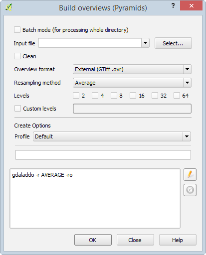
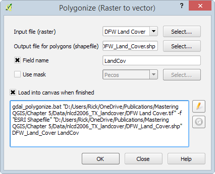
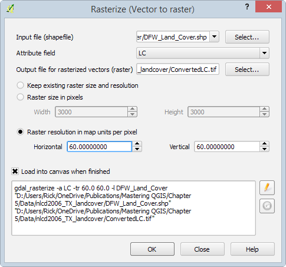
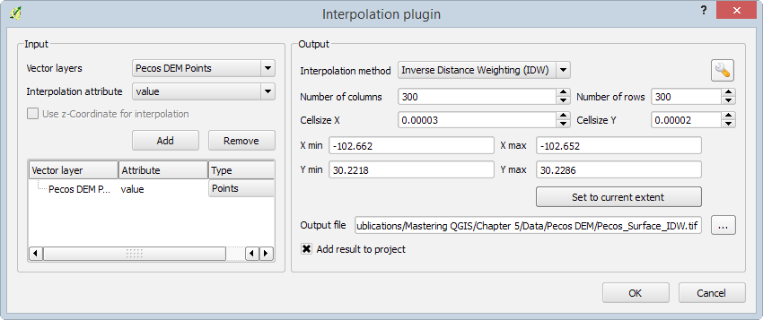
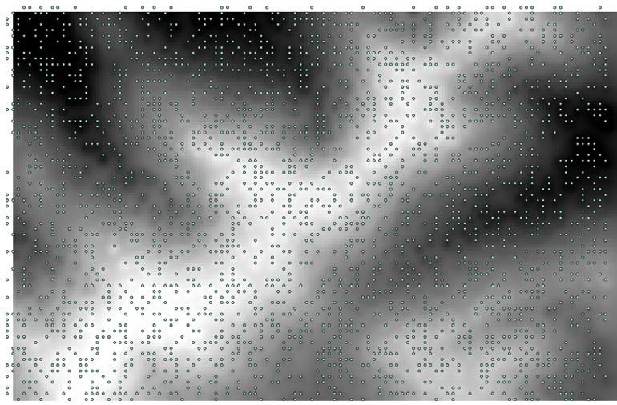

# Chapter 5: Preparing Raster Data for Processing

This chapter covers how to prepare raster data for further processing with the GDAL menu tools and Processing Toolbox algorithms.  
There are specifi considerations and tools for managing raster data.  
The topics that you will cover in this chapter are as follows:   


* Reclassification  
* Resampling  
* Rescaling  
* Raster mosaics  
* Generating overviews (pyramids)  
* Data format conversions  
* Interpolation  

## 5.1 Reclassifying rasters

Raster data sets often have hundreds or thousands of values.  
For an analysis, you may need to synthesize the data into meaningful categories.  
For example, elevation may be an important input in a habitat model for species X.  
However, you may only be interested in identifying several broad elevation thresholds that help to defie the habitat.  
In the following example, you will use the elevation.tif sample data.  
You will reclassify the elevation data into several categories: less than 2000 meters, 2000 to 2500 meters, and greater than 2500 meters.  
This will result in a raster with three values: one for each group of elevation values.  
The following steps outline how to use the r.recode GRASS tool (found in the processing toolbox) to accomplish this:  
  
1. Load elevation.tif and set the project's CRS to EPSG: 26912.  
2. Turn on the Processing plugin (by navigating to Plugins | Manage and Install Plugins) if it is not enabled.  
3. Open the Processing panel by clicking on Toolbox under Processing.  
4. To help locate the tool, type recode into the Processing Toolbox search bar and hit the Enter key. Double-click on the tool to open it.  
5. Select the input layer by clicking on the down arrow to choose a raster loaded in the canvas or by clicking on the browse button.  
6. Next, the tool will ask for a value to be filed in the File containing recode rules [optional] fild. This fie has to be created in a text editor. The syntax for the recode rules fie is as follows:  
```  
input_value_low:input_value_high:output_value_low:output_value_  
high  
input_value_low:input_value_high:output_value  
*:input_value:output_value  
input_value:*:output_value  
```  
7. The following are the recode rules for this example. The fist line tells the tool to recode the values less than 2000 meters with a value of 1 in the output raster. The fist asterisk is a wildcard for every value less than 2000. The second line recodes the values greater than and equal to 2000 and less than 2500 as 2 in the output raster. The third line recodes all values greater than 2500 as 3 in the output raster:  
```  
*:2000:1  
2000:2500:2  
2500:*:3  
```  
8. Save the preceding code to a text fie named Elevation_rRecode_Rules.txt.  
9. Select the output raster by clicking on the browse button. You can choose either to Save to a temporary fie or Save to fie. The following screenshot shows the completed r.recode tool:  
  
> There is a similar __GRASS tool__ in the Processing Toolbox named __r.reclass__.  
The r.reclass tool is used when reclassifying integer and categorical rasters, while r.recode will reclassify flating-point and decimal value rasters.  
Both tools use the same format for the rules text fie.  
More complete documentation for these tools can be found on the GRASS GIS help pages at http://grass.osgeo.org/grass65/manuals/r.reclass.html and http://grass.osgeo.org/grass65/manuals/r.recode.html.  
  


### 5.1.1 Converting datasets from floating point to integer rasters

Raster datasets may have integer values or flating-point values with decimal points.  
The __r.recode__ tool can also be used to convert raster datasets between these formats.  
The elevation.tif sample data is a flating-point raster with values ranging from 1502.1 to 2898.49 meters above sea level.  
  
> To see the full range of values in a raster, navigate to __Layer Properties | Style__.  
Under Load min/max values, select the Min/Max setting.  
For Accuracy, choose Actual (slower).  
Then, click on Apply.  
  
  
To convert this raster to an integer raster, you will need to set up a rule text fie with the following text:  
```  
1502.1:2898.49:1502:2898  
(input_value_low:input_value_high:output_value_low:  
output_value_high)  
```  
Conversely, if you have an integer raster with values between 10 and 500 and want to convert it to flating point, you will need to set up a rule text fie with this:  
```  
10:500:0.1:5.0  
```  
This will result in a raster with cell values ranging from 0.1 to 5.0.  


### 5.1.2 Resampling rasters

When an analysis requires that multiple raster datasets be combined or overlaid, their pixel resolutions should be equal.  
The spatial resolution or cell size of a raster can be increased or decreased by a process known as resampling.  
Although you can increase or decrease the resolution of a raster, it is considered a better practice to decrease the resolution of the finer datasets to match the resolution of the coarsest raster.  
  
As an example, let's say you have two rasters: a 90-meter resolution elevation raster and a 30-meter vegetation raster.  
In this scenario, it would be best to resample the vegetation data to a 90-meter resolution to match the elevation data.  
This way all the data will be matched accurately.  
Conversely, if you resample to match the finest resolution raster, you will introduce false accuracy.  
The elevation data has a 90-meter resolution because that was the smallest unit that could be differentiated from the neighboring pixels.  
If you increase the spatial resolution, each elevation pixel is converted to nine 30-meter pixels.  
You cannot assume that all nine resulting pixels actually have the same elevation value in the real world.  
It is more likely that only the center pixel would have the same value.  
  
In QGIS, there are several tools that can be used to resample a raster.  
In this example, the GDAL Translate tool will be used.  
The resolution of the elevation.tif sample data will be changed from 27.3526 meters to 100 meters.  
While the Translate tool can be found by navigating to __Raster | Conversion | Translate__, you will use the Processing Toolbox implementation of it here because it has better options for specifying the output pixel size.  
As you'll see this tool can be used for a variety of raster conversions during the resampling process.  
As you'll see in the following steps, this tool can be  used for a variety of raster conversions during the resampling process:  
1. Open the Processing Toolbox.  
2. Switch to the advanced view.  
3. Locate the tool by navigating to __GDAL/OGR | Conversion | Translate (convert format)__.  
4. Select the Input layer raster by clicking on the down arrow to choose a raster loaded in the canvas. or by clicking on the browse button.  
5. For a specific output resolution, enter the number in the Set the size of the output file (In pixels or %) box. To change the resolution by a percentage, click on the Output size is a percentage of input size box.  
6. If there are cells to designate as Nodata cells, enter the value in the Nodata value, leave as none to take the nodata value from input field. Otherwise, leave this option blank.  
7. If there is a one-band raster with a color table, use the Expand drop-down menu to choose a setting for converting it to a three-band image.  
8. To change the CRS of the raster during the resampling operation, specify the new output CRS by clicking on the browse button for the Output projection for output file [leave blank to use input projection] option box.  
9. To subset or clip the raster during the resampling operation, enter the coordinates for the desired spatial envelope in the Subset based on georeferenced coordinates (xmin, xmax, ymin, ymax) option box.  
10. Additional creation parameters can be specified. For a full list of options for the gdal_translate utility, visit the help page at http://www.gdal.org/gdal_translate.html.  
11. Use the Output raster type drop-down menu to choose the radiometric resolution of the output raster. The options are __Byte, Int16, UInt16, UInt32, Int32, Float32, Float64, CInt16, CInt32, CFloat32, and CFloat64__.  
> The Output raster type setting in the Translate tool of the Processing Toolbox can also be used to convert from floating-point rasters to integer rasters and vice versa.  
With a floating-point raster as the input, choose one of the integer settings to convert the raster to an integer.   
12. Select the output raster by clicking on the browse button. You can choose to either Save to a temporary file or Save to file. The following screenshot shows the completed Translate tool:


The following figure shows the result of raster resampling.  
The original elevation raster with 27.3526 meter pixel resolution is on the left and the resampled raster with 100 meter pixel resolution is on the right.  


> There are two additional tools that can be used to resample raster data, and both are found in the Processing Toolbox.  
Under __GRASS commands | Raster tools__ there is the __r.resample__ tool.  
Under __SAGA | Grid-Tools__ there is the __Resampling tool__.  
Both these tools have similar options to the GDAL Translate tool and are included with most installations of QGIS.  
   


* __Installing and troubleshooting SAGA different platforms__  

__SAGA, like GRASS GIS, is a standalone application whose tools can be accessed from within the QGIS Processing Toolbox.__  
To do this, you need to have both QGIS and SAGA installed.  
The processing framework must also be configured properly so that QGIS can access the SAGA command-line executable.  
The following are guides for installing and troubleshooting SAGA on each operating system.  


If you encounter the missing dependencies error, perform the following steps:  
1.  Open SAGA by navigating to __Processing | Options | Providers__ and uncheck Use SAGA 2.0.8 syntax:  
  
2.  If you still get the error, identify the installation path for SAGA. In QGIS, navigate to __Settings | Options | System__ and make sure that the __PATH__ variable includes the value for the path to the SAGA binaries. This can be found under Current environment variables, as shown in the following screenshot:  
   

## 5.2 Rescaling rasters

When an analysis calls for multiple rasters to be combined mathematically, it is often desirable to have the values in each raster converted to a common scale.  
For example, in a site-selection analysis, you need the data values for the input rasters to be scaled from 0 to 100.  
This can be done with the advanced interface by navigating to Processing __Toolbox | GRASS commands | Raster | r.rescale tool__.  
In the following example, the RiparianSurface.img raster with values ranging from 10 to 95.5 will be rescaled to a raster with values ranging from 0 to 100.  
To do this, perform the following steps:  
1. Select the input raster layer by clicking on the down arrow to choose a raster loaded in the canvas, or by clicking on the browse button.  
2. Specify The input data range to be rescaled.  
3. Specify The output data range.  
4. Select the output raster layer by clicking on the browse button and choosing  
Save to a temporary file or Save to file:  


## 5.3 Creating a raster mosaic

Frequently, raster data is made available in tiles.  
In fact, some consider the Murphy's Law of GIS to be that your study area lies at the intersection of four topographic quadrangles.  
In this situation, the input rasters will need to be combined into a seamless raster that covers the study area.  
When doing this, the individual input rasters must all be in the same coordinate reference system and have the same number of bands.  
  
Assuming that these two conditions have been met, the Merge tool that can be found by navigating to __Raster | Miscellaneous__ can be used to merge the individual rasters together.  
This tool is a GUI version of the __GDAL_merge__ command-line tool.  
Overlap among the input rasters is allowed.  
If this happens, the data for the last image in the list will be used for the area of overlap.  
In the Merge dialog, you have the option to choose whether you wish to merge all the rasters in a folder or you can pick individual rasters to merge.  
This provides a nice built-in batch-processing option.  
The following are the options for running the Merge tool:  
1.  Depending on how your data is stored, you can choose one of the following options:  
* Select Choose input directory instead of files.  
* Click on the Select… button and select the individual rasters to merge. In the following example, the sample data 35106-G4.tif, 35106-G5.tif, 35106-H4.tif, and 35106-H5.tif are being merged. (Note that this data has a CRS of EPSG: 26913, so the project CRS should be set to this.)  
2.  Name the output file by clicking on Select….  
3.  If the rasters include a no-data value, you can select No data value and specify this value.  
4.  If the input rasters cover the same geography but contain different bands of information, this tool can be used to create a multiband image. By choosing the Layer stack option, each input fi  becomes a separate band in a stacked image.  
The Use intersected extent option specifies the spatial envelope for the output. It defaults to the extent of the inputs.  
5.  If the images include a color table that can be passed on to the output by choosing the Grab pseudocolor table from the first image option, this option assumes that the same color table is used for all the input rasters.  


> Notice that the syntax equivalent to the gdal_merge command line is displayed as you choose your merge options.  
If you are familiar with the GDAL command-line syntax, you can use the edit button ( ) to set the tool options by editing the command directly.  
For example, you could specify the output image format as a 16-bit integer by using the __```–ot Int16```__ parameter.  
You could also specify the output pixel size with the __```–p```__ parameter.  
The GDAL help page for this command can be found at http://www.gdal.org/gdal_merge.html.  
The Creation Options allow you to add your own command-line options and set parameters, such as the compression profile to be used on the output image.  


The following screenshot shows the Merge command that is configured to mosaic
the collection of input rasters. The equivalent command-line syntax is displayed in
the window:  


>  There are two additional tools in QGIS that can be used to create raster mosaics.  
Both of these require the rasters to be merged and loaded into the QGIS map canvas.  
* The first is the GRASS tool r.patch.  
It can be found by navigating to __Processing Toolbox | Grass Commands | Raster | r.patch__.  
* The second tool is the SAGA tool Merge raster layers.  
This tool can be found by navigating to __Processing Toolbox | SAGA | Grid- Tools | Merge raster layers__.  
This SAGA tool lets you determine how overlapping cells in the set of input rasters will be handled.  
You can choose to use the first value in the order of the grid list or the mean value.  
It also allows you to choose the interpolation method.  
See the following figure:   


```python

```

## 5.4 Generating raster overviews (pyramids)

__A raster pyramid is a reduced-resolution version of a raster.__  
The purpose of a pyramid is to reduce the time it takes to display a raster.  
Pyramids can be built at multiple levels to help strike a balance between the pyramid's file size and the display speed.  
  
To build a raster overview in QGIS, click on __Build Overviews (Pyramids)__ by navigating to __Raster | Miscellaneous__.  
This will open the Build overviews (Pyramids) tool window, as shown in the following screenshot:    



  
The Build overviews tool provides a few options as well as the ability to edit the GDAL command that will build the overviews.  
By selecting Batch mode, an entire directory of rasters will be processed, instead of the default of a single raster.  
In either case, the following options are available:  
* __Input file__: The raster (or directory of rasters) that will have overviews built.  
* __Clean__: If this is selected, any previously built overviews will be deleted.  
* __Overview format__: The format of the built overviews. The options are as follows:    
 * __External (GTiff.ovr)__: In this format, the overviews are stored in the external .ovr file. The file will have the same base name as the original input file.  
 * __Internal (if possible)__: In this format, the overviews are stored within the raster file. Note that the Clean option will not remove previously built internal overviews.  
 * __External (Erdas Imagine .aux)__: In this format, the overviews are stored in the external .aux file. The file will have the same base name as the original input file.  
* __Resampling method__: The resampling method used to downsample the input raster.  
* __Levels__: This provides the options for the levels for which the overviews should be built. The values represent the amount of reduction in resolution for each level. For instance, level 8 represents a resolution of one-eighth of the original raster. Multiple levels can be selected.  
* __Custom levels__: A custom set of levels can be specified. Levels must be specified as positive integers that are separated by spaces.  
* __Profile__: If External or Internal overview formats are selected, a compression profile can be selected. The profile sets parameters that are required to  reach the selected compression level. Once a profile is selected, it appears underneath the text box.  
  
The Build overviews tool is essentially a frontend for the gdaladdo GDAL command.  
So, at the bottom of the tool window, the GDAL command is displayed and modified when options are selected.  
To manually change the GDAL command, press the Edit button ( ) to make the GDAL command editable.  

> The gdaladdo GDAL command builds or rebuilds pyramids for raster data.  
For more detailed information about this command and its parameters, visit the documentation page at http://gdal.org/gdaladdo.html.  
  


## 5.5 Converting between raster and vector data models

QGIS provides tools to convert between raster and vector data models. In this section, we will convert between the two data models using a national land cover dataset of 2006 for the Dallas area in Texas.

### 5.5.1 Converting from raster to vector

To convert a raster to a vector format, QGIS provides the Polygonize tool.  
The Polygonize tool converts an input raster file into any supported type of vector file and writes the raster cell values to a field in the vector file.  
When the raster is polygonized, adjacent cells of the same value are aggregated to a single larger polygon.  

To access the Polygonize tool, click on __Polygonize (Raster to Vector)__ by navigating to __Raster | Conversion__.  
The Polygonize tool is shown in the following screenshot and uses the sample DFW Land Cover.tif file as input:   



To convert a raster to a vector polygon, the following options are available:  
* __Input file (raster)__: Input file to be polygonized.  
* __Output file for polygons (shapefile)__: Name and extension of the output file that will hold the resulting polygons. Note that dozens of common vector formats are supported, so be sure to specify the extension for the format that you wish to use.  
* __Field name__: The field name that will hold the cell values.  
* __Use mask__: If selected, the specified file will be used to mask the input.  
* __Load into canvas when finished__: Loads the output file into the QGIS canvas.  

The Polygonize tool is essentially a frontend for GDAL. So, at the bottom of the tool window, the gdal_polygonize GDAL command is displayed and modified when the options are selected. To manually change the GDAL command, press the Edit button ( ) to make the GDAL command editable.  


> The gdal_polygonize GDAL command produces polygon features from raster data.  
For more detailed information about this command and its parameters, visit the documentation page at http://gdal.org/gdal_polygonize.html.  

> There is a similar __GRASS__ tool in the Processing Toolbox named __```r.to.vect```__ that converts a raster to a polygon, line, or a point-vector format.  
Complete documentation for this tool can be found on the GRASS GIS help pages at http://grass.osgeo.org/grass65/manuals/r.to.vect.html.  
   


### 5.5.2 Converting from vector to raster (rasterize)

To convert a vector to a raster format, QGIS provides the Rasterize tool.  
This tool converts a shapefile to a raster and applies the values in a specified attribute field to the cell values.  
To access the Rasterize tool, click on __Rasterize (Vector to Raster)__ by navigating to __Raster | Conversion__.  
The Rasterize tool, shown in the following figure, uses the DFW_Land_Cover.shp sample file as input.  
   




To convert a vector to a raster, the following options are available:  
* __Input file (shapefile)__: The input vector file to be converted. The tool supports multiple vector formats.  
* __Attribute field__: The attribute field holds the value to assign to the raster cells.  
* __Output file for rasterized vectors (raster)__: The output raster file. The tool supports multiple raster formats.  
* __Keep existing raster size and resolution__: This is only selectable if the output file already exists. This sets the output raster size and resolution to match the existing output file.  
* __Raster size in pixels__: This allows manual designation of raster width and height in pixels.  
* __Raster resolution in map units per pixel__: This allows manual designation of raster width and height in the units of the map.  
* __Load into canvas when finished__: Loads the output file in to the QGIS canvas.  
  
The Rasterize tool is essentially a frontend for GDAL.  
So, at the bottom of the tool window, the gdal_rasterize GDAL command is displayed and modified when the options are selected.  
To manually change the GDAL command, press the Edit button ( ) to make the GDAL command editable.  


> The gdal_rasterize GDAL command burns vector geometries into the raster band(s) of a raster.  
For more detailed information about this command and its parameters, visit the documentation page at http://gdal.org/gdal_rasterize.html.  
  
  

> There are two similar GRASS tools in the Processing Toolbox named v.to.rast.attribute and v.to.rast.value that convert a vector to the raster format.  
The v.to.rast.  
attribute tool assigns attribute values to the output raster cells.  
The v.to.rast.value tool assigns a single value or calculated value to the output raster cells.  
Complete documentation for these tools can be found on the GRASS GIS help pages at http://grass.osgeo.org/grass71/manuals/v.to.rast.html.  

## 5.6 Creating raster surfaces via interpolation

QGIS supports surface interpolation from vector points to a raster using the Interpolation plugin. 
The Interpolation tool supports Inverse Distance Weighted (IDW) and Triangular Interpolation (TIN). 
To enable the Interpolation plugin, click on Manage and Install Plugins under Plugins.

As an example of how to use the Interpolation tool, let's use the Pecos DEM Points. shp sample file to interpolate a surface using IDW:
1.  Add Pecos DEM Points.shp to the map canvas.
2.  Open the Interpolation plugin tool by navigating to __Raster | Interpolation | Interpolation__. The tool is shown in the following figure and uses the Pecos DEM Points.shp sample file as the input vector layer: 
  
The interface of the Interpolation tool is identical whether IDW or TIN is chosen as the interpolation method.  
The only exceptions are the interpolation method parameters, which can be set by clicking on the configure button ( ).  
For this example, we will only cover the IDW parameter (distance coefficient); however, you must know that for TIN, you can set the Interpolation method (linear or cubic) and have the option to export the triangulation to shapefile.  
   
3.  In the Input area, the Vector layers combo box is populated with all the valid vector layers added to the QGIS project. Make sure that Pecos DEM Points is selected.
4.  Select value as the interpolation attribute. This will be the value that is used as input for the interpolation method. If the input vector supports 3D geometry, we could optionally select Use z-Coordinate for interpolation instead of choosing an attribute.
5.  Click on Add to add the vector layer and the selected attribute to the layer list. At this point, we could add additional input vector layers to use as inputs. The inputs will be combined into a single input.
6.  Moving to the Output section, select Inverse Distance Weighted (IDW) as the interpolation method.
7.  Click on the configure button ( ) to access the Distance coefficient (P value) parameter. Enter 3.0 to decrease the influence of distant points for the interpolation. Click on OK to set the value.
8.  Set the Number of columns value to 200. Note that as you type in the  value, the Cellsize X value changes to 0.00005. These two values are linked together and are automatically calculated based on the extent values listed (X min, X max, Y min, Y max).
9.  Set the Cellsize Y value to 0.0005 to match the Cellsize X value. Again, note that as you type in the value, the Number of rows value changes to 127. The extent values can be manually changed by typing in the desired values, or they can be automatically filled with the current extent of the map canvas by clicking on Set to current extent. The default extent is set to the extent of the input vectors.
10. Set the output file to Pecos_IDW.tif.
11. Select Add result to project to automatically add the interpolated raster to the map canvas. Click on OK to execute the IDW interpolation.

The following figure shows the resulting raster from the IDW interpolation with the
Pecos DEM Points.shp input points on top:
 



There are additional interpolation tools available via the Processing Toolbox.  
In the GRASS commands, there are __```v.surf.bspline, v.surf.idw, and v.surf.rst```__, which interpolate using the bicubic or bilinear spline, inverse distance weighted, and regularized spline, respectively.  
In the SAGA commands, there are many interpolation methods under the Grid – Gridding, Grid – Spline, and Kriging sections in the advanced interface of the Processing Toolbox.  
  


## 5.7 Summary

This chapter provided steps and examples showing how to prepare raster data   for further processing.  
This chapter covered common raster operations such as reclassification, resampling, rescaling, mosaicking, interpolation, and so on.  
__Many of the tools shown in this chapter rely on GDAL to perform the calculations, while others are included as part of plugins or QGIS.__  
Where applicable, alternative tools were noted in information boxes, as different tools may provide different functionality or parameters.  

In the next chapter, we will switch from modifying and preparing existing data (as discussed in Chapter 4, Preparing Vector Data for Processing, and this chapter) to creating data.  
The next chapter will cover __creating points from raw coordinate data, geocoding, georeferencing imagery, and topology operations__.  
   


```python

```
