# Chapter 6: Advanced Data Creation and Editing


<!-- toc orderedList:0 depthFrom:1 depthTo:6 -->

* [Chapter 6: Advanced Data Creation and Editing](#chapter-6-advanced-data-creation-and-editing)
  * [6.1 Creating points from coordinate data](#61-creating-points-from-coordinate-data)
    * [6.1.1 Mapping well-known text of geometry](#611-mapping-well-known-text-of-geometry)
  * [6.2 Geocoding address-based data](#62-geocoding-address-based-data)
    * [6.2.1 How address geocoding works](#621-how-address-geocoding-works)
    * [6.2.2 The first example – geocoding using web services](#622-the-first-example-geocoding-using-web-services)
    * [6.2.3 The second example – geocoding using local street network data](#623-the-second-example-geocoding-using-local-street-network-data)
  * [6.3 Georeferencing imagery](#63-georeferencing-imagery)
    * [6.3.1 Ground control points](#631-ground-control-points)
    * [6.3.2 Using the Georeferencer GDAL plugin](#632-using-the-georeferencer-gdal-plugin)
    * [6.3.3 The first example – georeferencing using a second dataset](#633-the-first-example-georeferencing-using-a-second-dataset)
    * [6.3.4 The second example – georeferencing  a point file](#634-the-second-example-georeferencing-a-point-file)
  * [6.4 Checking the topology of vector data](#64-checking-the-topology-of-vector-data)
    * [6.4.1 Installing the topology checker](#641-installing-the-topology-checker)
    * [6.4.2 Topological rules](#642-topological-rules)
    * [6.4.3 Using the Topology Checker](#643-using-the-topology-checker)
  * [6.5 Repairing topological errors via topological editing](#65-repairing-topological-errors-via-topological-editing)
    * [6.5.1 Example 1 – resolving duplicate geometries](#651-example-1-resolving-duplicate-geometries)
    * [6.5.2 Example 2 – repairing overlaps](#652-example-2-repairing-overlaps)
    * [6.5.3 Example 3 – repairing a gap between polygons](#653-example-3-repairing-a-gap-between-polygons)
  * [6.6 Summary](#66-summary)

<!-- tocstop -->


This chapter will provide you with more advanced ways to create vector and raster data.
There is a great deal of spatial data held in tabular format.
Readers will learn how to map coordinate and address-based data.
Other common sources of geospatial data are historic aerial photographs and maps in hard copy.
Readers will learn how to georeference scanned imagery and transform it into a target coordinate reference system.
The final portion of the chapter will cover testing topological relationships in vector data and correcting any errors via topological editing.

The topics that you will cover in this chapter are as follows:
* Creating points from coordinate data
* Geocoding address-based data
* Georeferencing imagery
* Checking the topology of vector data
* Repairing topological geometry errors via topological editing


## 6.1 Creating points from coordinate data

There is a lot of data with spatial components stored in spreadsheets and tables.
One of the most common forms of tabular spatial data are x and y coordinates that are stored in a delimited text file.
The data may have been collected with a GPS receiver, it may have been generated by a surveyor, or it may have been transcribed off topographic maps.
Regardless, QGIS can map these coordinates as points by using the Add Delimited Text Layer tool ( ).
This tool can be found by navigating to __Layer | Add Layer | Add Delimited Text Layer__ or on the __Manage Layers toolbar__.


Delimited text data is simply a table with column breaks that are identified by a specific character such as a comma.
__With this tool, QGIS can accept either x and y coordinates or Well-Known Text (WKT) representations of geometry.__
WKT can contain point, line, or polygon geometry.
The following is a sample data, cougar_sightings.csv, viewed in a text editor.
This is a comma-delimited file with x and y coordinate values.


In this example, the first row contains the column names and definitions for the data type in each column.
The column names and definitions are enclosed in quotes and are separated by commas.
The first column reads "SAMPID, C, 20".
In this case, the field name is SAMPID.
It is a text field signified by the letter C, which stands for character, with a width of 20 characters.
The final two columns contain the coordinates.
These are numeric fields signified by the N character.
They have a precision of 19 and a scale of 11.

__QGIS has three requirements for the delimited text file to be mapped:__
* The first row must be a delimited header row of field names
* The header row must contain field-type definitions
* If the geometry values are stored as x and y coordinate values, they must be stored as numeric fields

The Create a Layer from a Delimited Text File tool is simple but robust enough to handle many file-format contingencies.
__The following is the workflow for mapping data held in such a file:__
1. Navigate to __Layer | Add Layer | Add Delimited Text Layer__.
2. Select the file name by clicking on Browse... and locate the delimited text file on your system. QGIS will attempt to parse the file with the most recently used delimiter.
3. Select Layer name. By default, this will be the prefix of the delimited text file.

4. Use the File format radio boxes to specify the format of the delimited text file. You will see how QGIS is parsing the file by the example at the bottom of the Create a Layer from a Delimited Text File window. The following are the options for File format:
  * Choose CSV if it is a standard comma-delimited file.
  * Custom delimiters can be checked to identify the specific character used. The choices are Comma, Tab, Space, Colon, Semicolon, or Other delimiters.
  * Choose the Regular expression delimiter option if you wish to enter the regular expression for the delimiter. For example, \t is the regular expression for the tab character.
5. The Record options section allows you to specify the number of header lines to discard. In most cases, this option will be set to First record has field names.
6. The Field options option allows you to control some field parameters:
  * Check Trim fields if you need to trim leading or trailing spaces from your data
  * Check Discard empty fields to prevent empty fields from being put into the output
  * If commas are also the separators for decimal place values, check Decimal separator is a comma
7. Once the file has been parsed, choose an appropriate value from the Geometry definition option:
  * If your file contains x and y coordinates, choose Point coordinates and identify the fields containing the x and y coordinates.
  * Choose Well known text (WKT), if your file contains WKT geometries. For this option, you will also need to choose the field containing the WKT geometry definitions.
  * If the file does not contain any spatial information, choose No geometry and the table will be loaded simply as a table.
8. Additionally, you can choose to enable the following options:
  * Use spatial index: Creates a spatial index
  * Use subset index: Creates a subset index
  * Watch file: This setting watches for changes to the file by other applications while QGIS is running

9. After you click on OK, the Coordinate Reference System Selector dialog box will open. Use this dialog box to identify the coordinate reference system of the data. It is very important to correctly identify the CRS of the input data.


> here is a setting that can affect the behavior of the Coordinate Reference System Selector for both new layers and layers that are loaded into QGIS without a defined CRS.
By navigating to __Settings | Options | CRS__, you can choose how these situations are handled.
The choices are Prompt for CRS, Use Project CRS, or Use default CRS displayed below.
The default setting is Prompt for CRS.
However, if you have this set to Use project CRS or Use default CRS displayed below, then you will not be prompted to define the CRS as described earlier.


The following screenshot shows an example of a completed Create a Layer from a Delimited Text File tool.

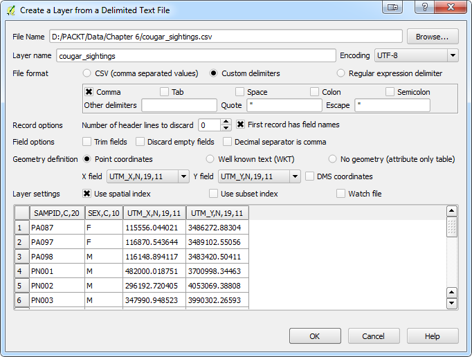

Once the tool has been run, a new point layer will be added to QGIS with all the attributes present in the original file (unless you chose to discard empty fields).
__However, this is not a standalone GIS layer yet.__
It is simply a rendering of the tabular data within the QGIS project.
As such, it will behave like any other layer.
It can be used as an input for other tools, records can be selected, and it can be  styled.
However, it cannot be edited.
__To convert the layer to a standalone shapefile or another vector format, click on Save as under Layer or right-click on the layer in the Layers panel and click on Save as.__
Here, you can __choose any OGR__ supported file format along with an output CRS of your choice.
The cougar_sightings.csv sample data has coordinates in UTM zone 13 NAD83 or EPSG:26913.
The following screenshot shows the mapped data in the cougar_sightings.csv sample data:


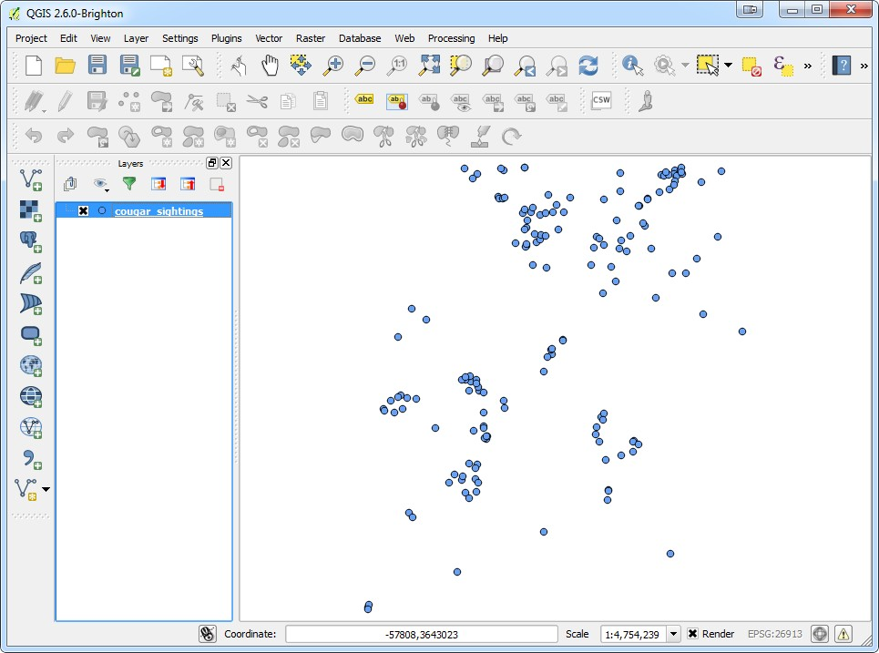

### 6.1.1 Mapping well-known text of geometry

As mentioned earlier, the Add Delimited Text Layer tool can also be used to map Well-Known Text (WKT) representations of geometry.
WKT can be used to represent simple geometries such as Point, LineString, and Polygon along with MultiPoint, MultiLineString, and MultiPolygon.
It can also represent more complex geometry types such as geometry collections, 3D geometries, curves, triangular irregular networks, and polyhedral surfaces.
WKT geometries use geometry primitives such as Point, LineString, and Polygon followed by the coordinates of vertices that are separated by commas.
For example, LINESTRING (30 10, 20 20, 40 30) would represent the line feature shown in the following screenshot:


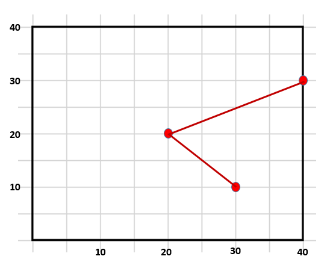


To demonstrate how WKT can be mapped via the Add Delimited Text Layer tool, we will map the Parcels_WKT.csv sample data file; this has WKT geometries for eight parcels (polygons):
1.  Click on Add Delimited Text Layer by navigating to Layer | Add Layer.
2.  Select the file name by clicking on Browse... and locate the delimited text file on your system. In this example, the Parcels_WKT.csv file is being used.
3.  Choose an appropriate value for the Layer name field. By default, this will be the prefix of the delimited text file.
4.  Use the File format radio buttons to specify the format of the delimited text file. This is a CSV file.
5.  For Record options, set the Number of header lines to discard option as 1.
6.  Set the Geometry definition option to Well known text (WKT).
7.  Set the Geometry field option to field_1.
8.  Click on OK and the Coordinate Reference System Selector will open. Use this dialog box to identify the coordinate reference system of the data. For this example, the data is in EPSG: 2903.

The following screenshot shows __an example of a completed Create a Layer from a Delimited Text File tool set up to parse a WKT file:__

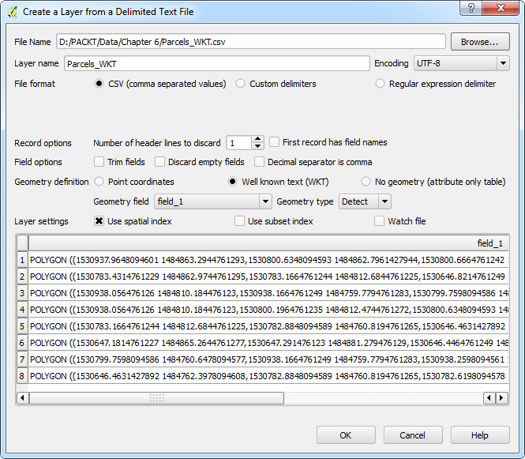


The data layer will be added to the Layers list and will behave like any other vector layer.
The following figure shows the resulting parcel boundaries:

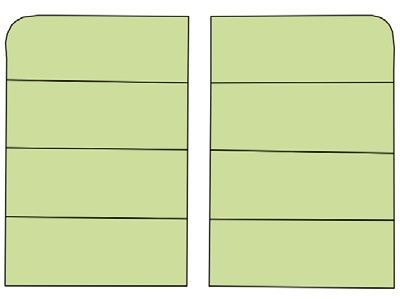

Well-known text representations of parcels mapped via the Add Delimited Text Layer tool


>  An easy way to __explore WKT geometries__ is to use the __getWKT plugin__.
This allows you to click on a selected feature (in the QGIS map canvas) and see the WKT for that feature.
The WKT can be copied to the clipboard.


## 6.2 Geocoding address-based data

Another useful and common tabular spatial data source is a street address.
Geocoding addresses has many applications such as mapping the customer base for a store, members of an organization, public health records, or incidence of crime.
Once they are mapped, the points can be used in many ways to generate information.
For example, they can be used as inputs to generate density surfaces, or they can be linked to parcels of land, and characterized by socio-economic data.
They may also be an important component of a cadastral information system.

An address geocoding operation typically involves the tabular address data and a street network dataset.
The street network needs to have attribute fields for address ranges on the left- and right-hand side of each road segment.
You can geocode within QGIS using a plugin named MMQGIS (http://michaelminn.com/linux/mmqgis/).
MMQGIS is a collection of vector data-processing tools developed by Michael Minn.
To install the plugin, perform the following steps:

1.  Navigate to __Plugins | Manage__ and Install Plugins.
2.  Click on the All tab and type MMQGIS into the search bar.
3.  Install the plugin that manifests as the MMQGIS menu.

MMQGIS has many useful tools.
For geocoding, you will use the tools found in Geocode under MMQGIS.
There are two tools there: Geocode CSV with Google/ OpenStreetMap and Geocode from Street Layer.
The fi  allows you to geocode a table of addresses using either the Google Maps API or the OpenStreetMap Nominatim web service.
This tool requires an Internet connection but no local street network data.
The web services provide the street network.
The second tool uses a local street network dataset with address-range attributes to geocode the address data.


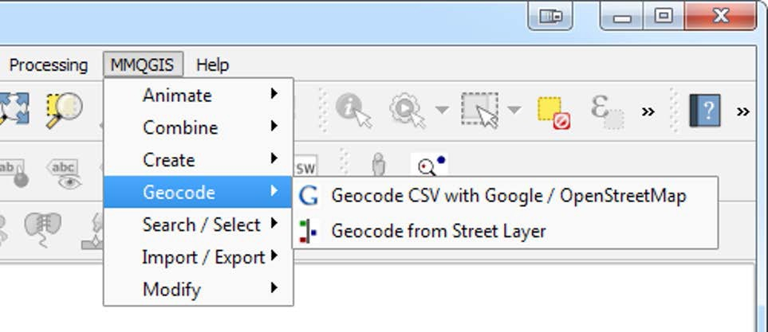

### 6.2.1 How address geocoding works

The basic mechanics of address geocoding are straightforward.
The street network GIS data layer has attribute columns containing address ranges on both the even and odd side of every street segment.
In the following example, you see a piece of the attribute table for the Streets.shp sample data.
The columns LEFTLOW, LEFTHIGH, RIGHTLOW, and RIGHTHIGH contain the address ranges for each street segment.

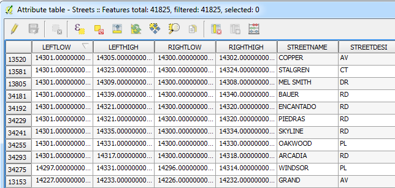


In the following example, we are looking at Easy Street.
On the odd side of the street, the addresses range from 101 to 199.
On the even side, they range from 102 to 200.
If you want to map 150 Easy Street, QGIS would assume that the address is located halfway down the even side of that block.
Similarly, 175 Easy Street would be on the odd side of the street, roughly three-quarters of the way down the block.
Address geocoding assumes that the addresses are evenly spaced along a linear network.
QGIS should place the address point very close to its actual position, but due to variability in lot sizes not every address point will be perfectly positioned.


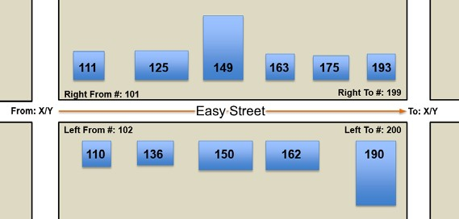

Now that you've learned the basics you'll see how each MMQGIS geocoding tool works.
Here, both tools will be demonstrated against the Addresses.csv sample data.
The first  example will use web services.
The second example will use the Streets.
shp sample data.
In both cases, the output will be a point shapefi e containing all the attribute fields found in the source Addresses.csv file.

### 6.2.2 The first example – geocoding using web services

Here are the steps for geocoding the Addresses.csv sample data using web services.
1. Load the Addresses.csv and Streets.shp sample data into QGIS Desktop.
2. Open the Addresses.csv sample data and examine the table. These are addresses of municipal facilities. Notice that the street address (for example, 150 Easy Street) is contained in a single field. There are also fields for the city, state, and country. Since both Google and OpenStreetMap are global services, it is wise to include such fields so that the services can narrow down the geography.
3. Install and enable the MMQGIS plugin.
4. Navigate to MMQGIS | Geocode | Geocode CSV with Google/ OpenStreetMap. The Web Service Geocode dialog window will open.
5. Select an appropriate value for the Input CSV File (UTF-8) field by clicking on Browse... and locating the delimited text file on your system.
6. Select the address fields by clicking on the drop-down menu and fill suitable values in the Address Field, City Field, State Field, and Country Field fields. MMQGIS may identify some or all of these fields by default if they are named with logical names such as Address or State.
7. Choose the web service.
8. Name the output shapefile by clicking on Browse....
9. Select a value for the Not Found Output List field by clicking on Browse.... Any records that are not matched will be written to this file. This allows you to easily see and troubleshoot any unmapped records.
10. Click on OK. The status of the geocoding operation can be seen in the lower- left corner of QGIS. The word Geocoding will be displayed, followed by the number of records that have been processed.
11. The output will be a point shapefile and a CSV file listing the addresses that were not matched.

The following screenshot shows the completed Web Service Geocode tool:


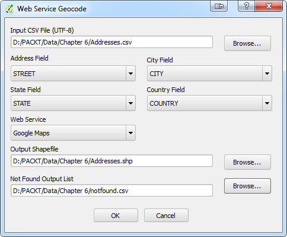

> Two additional attribute columns will be added to the output address point shapefile: addrtype and addrlocat.
These fields provide information on how the web geocoding service obtained the location.
These may be useful for accuracy assessment.
addrtype is the Google <type> element or the OpenStreetMap class attribute.
This will indicate what kind of address type was used by the web service (highway, locality, museum, neighborhood, park, place, premise, route, train station, university, and so on).
addrlocat is the Google <location_type> element or OpenStreetMap type attribute.
This indicates the relationship of the coordinates to the addressed feature (approximate, geometric center, node, relation, rooftop, way interpolation, and so on).
If the web service returns more than one location for an address, the first of the locations will be used as the output feature.
Use of this plugin requires an active Internet connection.
Google places both rate and volume restrictions on the number of addresses that can be geocoded within various time limits.
You should visit the Google Geocoding API website (http://code.google.com/apis/maps/documentation/geocoding/) for more details, current information, and Google's terms of service.
Geocoding via these web services can be slow.
If you don't get the desired results with one service, try the other.


### 6.2.3 The second example – geocoding using local street network data

Here are the steps for geocoding the Addresses.csv sample data using local street network data:
1.	Load the Addresses.csv and Streets.shp sample data.
2.	Open the Addresses.csv sample data and examine the table. This contains the addresses of municipal facilities. Notice that there is an address column (for example, 150 Easy Street) along with separate columns for number (150) and street (Easy). This tool requires that the number and street address components be held in separate fields.
3.	Install and enable the MMQGIS plugin.
4.	Navigate to the MMQGIS | Geocode | Geocode from Street Layer menu and open the Geocode from Street Layer dialog window.
5.	Select the Addresses.csv sample data as the Input CSV File (UTF-8) field by clicking on Browse... and locating the delimited text file on your system.
6.	Select the street name field from the Street Name Field drop-down menu.
7.	Select the number field from the Number Field drop-down menu.
8.	Select the zip field from the ZIP Field drop-down menu.
9.	Select the street GIS layer loaded in QGIS from the Street Layer drop-down menu.
10.	Select the street name field of the street layer from the Street Name Attribute drop-down menu.
> This tool allows geocoding from street address ranges or via From X Attribute and To X Attribute coordinates.
The latter assumes that you have attribute columns with the To and From coordinates for each street segment.
To geocode via To and From coordinates select the From X Attribute, To X Attribute, From Y Attribute, and To Y Attribute fields from the drop-down menu.
11.	In this example, only address ranges will be used. Populate the From X Attribute, To X Attribute, From Y Attribute, and To Y Attribute dropdown menus with the (street line start), (street line end), (street line start), and (street line end) option.
12.	Since address ranges will be used for geocoding, select the Left From Number, Left To Number, Right From Number, and Right To Number attributes from the drop-down menu.
13.	If the street data has left and right zip code attributes, select Left Zip and Right Zip from the drop-down menu. Since the Streets.shp sample data does not have zip code attributes, these options will the left blank (none).
14.	The Bldg. Setback (map units) option can be used to offset geocoded address points from the street centerline. This should represent how far buildings are from the middle of the street in map units. In this case, the map units are in feet. Enter a map unit value of 20.
15.	Name the output shapefile by clicking on Browse... button.
>  Geocoding operations rarely have 100 percent success.
Street names in the street shapefile must match the street names in the CSV file exactly.
Any discrepancy between the name of a street in the address table and the street attribute table will lower the geocoding success rate.
16.	The tool will save a list of the unmatched records. Complete the Not Found Output List field by clicking on Browse... button name the comma delimited file. Any records that are not matched will be written to this file. This allows you to easily see and troubleshoot any unmapped records.
17.	Click on OK.
18.	The output will be a point shapefile and a CSV file listing the addresses that were not matched. In this example, the output shapefile will have 199 mapped address points. There will be four unmatched records described in the Not Found CSV list. The following screenshot shows the completed Geocode from Street Layer tool:


The following screenshot shows the completed Geocode from Street Layer tool:

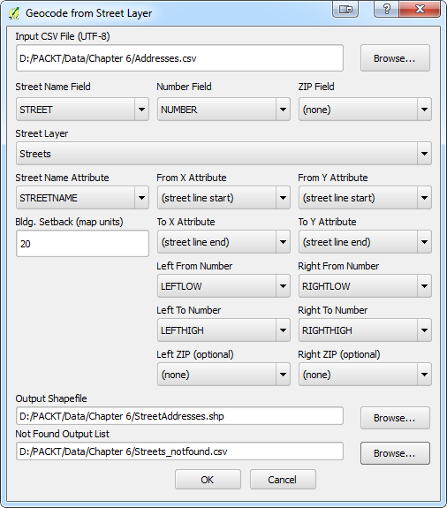


```python

```

## 6.3 Georeferencing imagery

Maps and aerial photographs in hard copy have a lot of valuable data on them.
When this data needs to be brought into a GIS, they are digitally scanned to produce raster imagery.
The output of a digital scanner has a coordinate system, but it is a local coordinate system created by the scanning process.
The scanned imagery needs to be georeferenced to a real-world coordinate system before it can be used in a GIS.

Georeferencing is the process of transforming the coordinate reference system (CRS) of a raster dataset into a new coordinate reference system.
Often, the process transforms the CRS of a spatial dataset from a local coordinate system to a realworld coordinate system.
Regardless of the coordinate systems involved, we'll call the coordinate system of the raster to be georeferenced as the source CRS and the coordinate system of the output as the destination CRS.
The transformation may involve shifting, rotating, skewing, or scaling the input raster from source coordinates to destination coordinates.
Once a data set has been georeferenced, it can be brought into a GIS and aligned with other layers.


### 6.3.1 Ground control points

Georeferencing is done by identifying ground control points (GCP).
These are locations on the input raster where the destination coordinate system is known.
Ground control points can be identified in one of the following two ways:

* Using another dataset covering the same spatial extent that is in the destination coordinate system.
This can be either a vector or a raster dataset.
In this case, GCPs will be locations that can be identified on both the datasets.
* Using datums or other locations with either printed coordinates or coordinates that can be looked up.
In this case, the locations are identified and the target coordinates are entered.

Once a set of ground control points has been created, a transformation equation is developed and used to transform the raster from the source CRS to the destination CRS.

Ideally, GCPs are well distributed across the input raster.
You should strive to create GCPs near the four corners of the image, plus several located in the middle of the image.
This isn't always possible, but it will result in a better transformation.


### 6.3.2 Using the Georeferencer GDAL plugin

The Georeferencer GDAL plugin is a core QGIS plugin, meaning it will be installed by default.
It is an implementation of the GDAL_Translate command-line utility.
To enable it, navigate to Plugins | Manage and Install Plugins and then click on the Installed tab and check the box to the left of Georeferencer GDAL plugin.
Once enabled, you can launch the plugin by clicking on Georeferencer under Raster.
The Georeferencer window has two main windows: the image window and the ground control point (GCP) table window.
These windows are shown in the following screenshot:


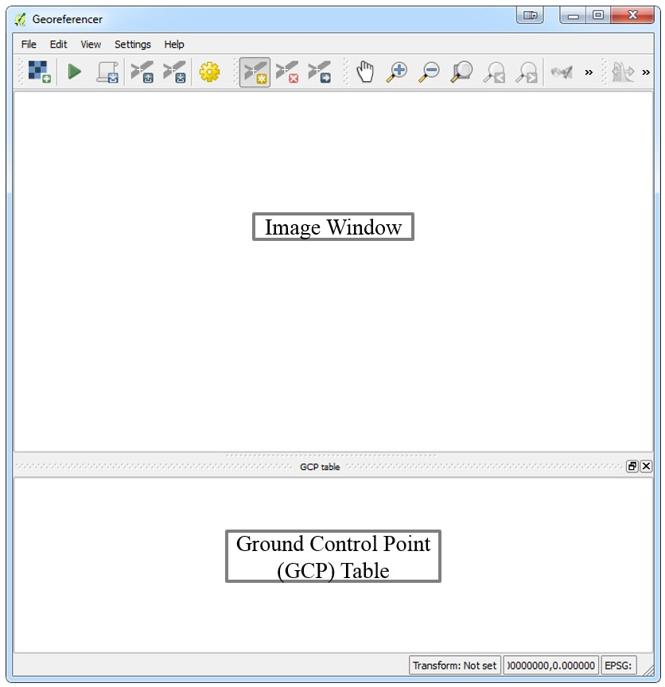

### 6.3.3 The first example – georeferencing using a second dataset
* __Getting started__
* __Entering ground control points__
* __Transformation settings__
* __Completing the operation__


```python

```

### 6.3.4 The second example – georeferencing  a point file


```python

```

## 6.4 Checking the topology of vector data

In GIS, there are two main data models: vector and raster.
They are called models because they are not real but are representations of the real world.
It is important that we ensure our data is modeling the world as accurately as possible.
Vector datasets often have hundreds or thousands of features making it nearly impossible to verify each feature.
However, using topology rules, we can let QGIS evaluate the geometry of our datasets and ensure that they are well constructed.

Topology is the relationship between contiguous or connected features in a GIS.
Here, you will be introduced to the Topology Checker plugin.
This plugin allows you to test topological relationships in your data and ensure that they are modeling the real world accurately.
An example of a topological relationship rule is polygons must not overlap.
Imagine a country boundaries dataset.
It is not possible for a point to be in two countries at once.
Therefore, polygons in such a dataset should not overlap.
The Topology Checker plugin can be used to test whether there are any overlapping polygons.


### 6.4.1 Installing the topology checker

Here are the steps for installing the Topology Checker plugin:
1. Navigate to Plugins | Manage and Install Plugins and click on the All tab.
2. In the search bar, type topology.
3. Select the Topology Checker plugin and click on Install plugin.
4. Once enabled, the Topology Checker plugin can be found by navigating to Vector | Topology Checker.
5. When the Topology Checker window opens, it appears as a panel in QGIS Desktop.


### 6.4.2 Topological rules

Different sets of topological rules are available depending on the feature geometry: point, line, or polygon.
Some rules test for relationships between features in a single layer and some test the relationships between features of two separate layers.
All participating layers need to be loaded into QGIS.
The following topological rule tests are available.


* __Rules for point features__
    The rules for point features are as follows:
    * must be covered by: This relationship test evaluates how a point layer interacts with a second vector layer. Points that do not intersect the second layer are flagged as errors.
    * must be covered by endpoints of: This relationship test evaluates how a point layer interacts with a line layer. Points that do not intersect the endpoints of the second layer are flagged as errors.
    * must be inside: This evaluates how a point layer interacts with a second polygon layer. Points not covered by the polygons are flagged as errors.
    * must not have duplicates: This evaluates if point features are stacked on top of one another. Additional points are with the same x and y position (stacked) as the first point queried are flagged as errors.
    * must not have invalid geometries: This checks whether the geometries are valid and if they are not, then it flags those features as errors.
    * must not have multi-part geometries: This flags all multi-part points as errors.


* __Rules for line features__
    The rules for line features are as follows:
    * end points must be covered by: This relationship test evaluates how a line layer interacts with a second point layer. The features that do not intersect the point layer are flagged as errors.
    * must not have dangles: This test will flag features that are dangling arcs.
    * must not have duplicates: This flags additional duplicate line segments (stacked) as errors.
    * must not have invalid geometries: This checks whether the geometries are valid and if they are not, then it flags those features as errors.
    * must not have multi-part geometries: This flags features that have a geometry type of multi-line as errors.
    * must not have pseudos: This tests lines for the presence of pseudo nodes. This is when there is a pair of nodes where there should only be one. These can interfere with network analysis. The features with pseudo nodes will be flagged as errors.


* __Rules for polygon features__
    The rules for polygon features are as follows:
    * must contain: This checks whether the target polygon layer contains at least one node or vertex from the second layer. If it doesn't, it is flagged as an error.
    * must not have duplicates: This flags additional duplicated stacked polygons as errors.
    * must not have gaps: This flags adjacent polygons with gaps as errors. Watersheds or parcel boundaries would be suitable for this test.
    * must not have invalid geometries: This checks whether the geometries are valid. Some of the rules that define a valid geometry are as follows:
      * Polygon rings must close
      * Rings that define holes should be inside rings that define exterior boundaries
      * Rings should not self-intersect (they may neither touch nor cross one another)
      * Rings should not touch other rings, except at a point
    * must not have multi-part geometries: This flags all multi-part polygons as errors.
    * must not overlap: This flags adjacent polygon features in the same layer that overlap one another as errors. Watersheds or parcel boundaries would be suitable for this test.
    * must not overlap with: This relationship test evaluates how polygon features from the target layer interact with polygon features from a second polygon layer. Those that do will be flagged as errors.


### 6.4.3 Using the Topology Checker

The parcels.shp sample data will be used to demonstrate how to set up and test topological relationships.
Here, the parcels polygon shapefile is loaded and the Topology Checker panel has been enabled by clicking on __Topology Checker under Vector__.
The following figure shows the parcels.shp sample data loaded into QGIS desktop and the Topology checker plugin enabled.


## 6.5 Repairing topological errors via topological editing


```python

```

### 6.5.1 Example 1 – resolving duplicate geometries

### 6.5.2 Example 2 – repairing overlaps

* __Setting the editing parameters__
* __Repairing an overlap between polygons__

### 6.5.3 Example 3 – repairing a gap between polygons

## 6.6 Summary

This chapter covered more advanced ways to create GIS data from different sources.
We provided explanations and step-by-step examples of mapping raw coordinate data, geocoding address-based data, georeferencing imagery, validating vector data with topological rules, and topological editing.
With the topics covered to this point, you will be able to work with a variety of vector, raster, and tabular input data.
In the next chapter, we will switch from preparing and editing data to performing spatial analyses.
We will cover the QGIS processing toolbox.
We will begin with a comprehensive overview and a description of layout of the toolbox.
We will then explore the various algorithms and tools that are available in the toolbox with realworld examples.
