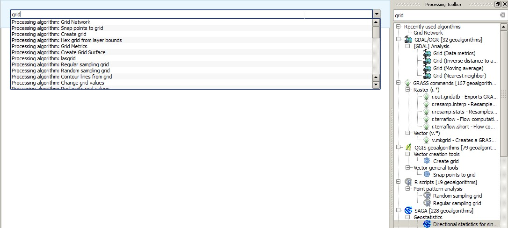
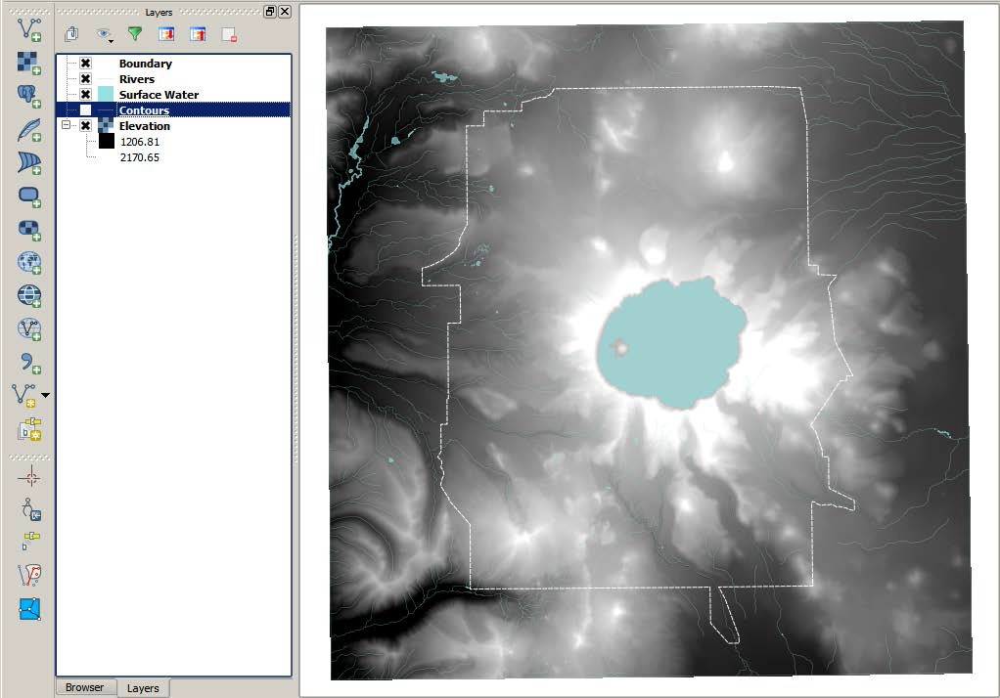
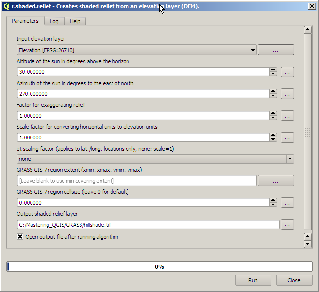
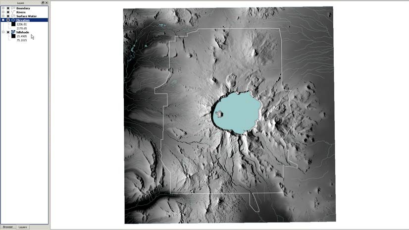

# Chapter 7: The Processing Toolbox

<!-- toc orderedList:0 depthFrom:1 depthTo:6 -->

* [Chapter 7: The Processing Toolbox](#chapter-7-the-processing-toolbox)
  * [7.1 About the processing toolbox](#71-about-the-processing-toolbox)
    * [7.1.1 Configuring the processing toolbox](#711-configuring-the-processing-toolbox)
    * [7.1.2 Understanding the processing toolbox](#712-understanding-the-processing-toolbox)
    * [7.1.3 Using the processing toolbox](#713-using-the-processing-toolbox)
  * [7.2 Performing raster analyses with GRASS](#72-performing-raster-analyses-with-grass)
    * [7.2.1 Calculating shaded relief](#721-calculating-shaded-relief)
    * [7.2.2 Calculating least-cost path](#722-calculating-least-cost-path)
    * [7.2.3 Evaluating a viewshed](#723-evaluating-a-viewshed)
  * [7.3 SAGA](#73-saga)
    * [7.3.1 Evaluating a habitat](#731-evaluating-a-habitat)
  * [7.4 Exploring hydrologic analyses with TauDEM](#74-exploring-hydrologic-analyses-with-taudem)
    * [7.4.1 Removing pits from the DEM](#741-removing-pits-from-the-dem)
    * [7.4.2 Calculating flow directions across the landscape](#742-calculating-flow-directions-across-the-landscape)
    * [7.4.3 Calculating the upstream area above Fort Klamath](#743-calculating-the-upstream-area-above-fort-klamath)
    * [7.4.4 Calculating a stream network raster grid](#744-calculating-a-stream-network-raster-grid)
    * [7.4.5 Creating a watershed-specific vector stream network](#745-creating-a-watershed-specific-vector-stream-network)
  * [7.5 R](#75-r)
    * [7.5.1 Exploring summary statistics and histograms](#751-exploring-summary-statistics-and-histograms)
  * [7.6 Summary](#76-summary)

<!-- tocstop -->


In this chapter, we will explore the structure of the QGIS processing toolbox, identify which algorithm providers are available, and how to use these specialized algorithms.
To accomplish these goals, we will ensure that the toolbox is properly configured, use a variety of specialized vector and spatial algorithms from the GRASS and SAGA libraries, and perform hydrologic analyses using the Terrain Analysis Using __Digital Elevation Models (TauDEM)__ library.
We will cover the following topics in this chapter:


* Introduction to the toolbox
* Confiuring the toolbox
* Structure of the toolbox
* Performing spatial analyses using GRASS and SAGA
* Performing a hydrologic analyses with TauDEM

## 7.1 About the processing toolbox

The processing toolbox serves as a one-stop-shopping GUI for accessing algorithms from both native QGIS tools and many third-party providers.
Historically, the algorithms from other geospatial packages were only accessible within the native software environment or through a command-line environment.
Algorithms from the following providers are accessible using the toolbox:
* QGIS geoalgorithms
* GDAL/OGR
* GRASS
* SAGA
* TauDEM
* LAStools
* R
* Orfeo Toolbox
* Models
* Scripts

We will not make use of all the algorithm providers or explore all the available algorithms in this chapter; however, the last two entries in the list offer additional options for creating reusable graphical models and running Python scripts, which are covered in Chapter 8, Automating Workflows with the Graphical Modeler, and Chapter 9, Creating QGIS Plugins with PyQGIS and Problem Solving, respectively.


### 7.1.1 Configuring the processing toolbox

In this section, we will ensure that the processing toolbox is correctly configured to access and execute the algorithms within the GRASS, SAGA, TauDEM, and LAStools libraries.
Many of the required libraries are automatically installed, but configuring these tools will vary depending on your operating system and how you choose to install QGIS.

> Finding support for your installation
To use some of the GRASS algorithms in this chapter, you will need to make sure that you properly install GRASS 7.
If you used the OSGeo installer, you can use the advanced installer option to add GRASS 7 to your installation, otherwise you will need to manually install GRASS 7 and set the path directory in the processing toolbox.
In-depth instructions for configuring SAGA are provided in Chapter 5, Preparing Raster Data for Processing.
__Instructions for configuring most third-party algorithms on different operating systems can be found on the QGIS website at__ http://docs.qgis.org/2.6/en/docs/user_manual/processing/3rdParty.html.
Support for installing __LAStools__ on Windows, Mac OS X, and Linux can also be found at http://rapidlasso.com/category/tutorials/.


To begin configuring the toolbox, we need to click on Options and configuration under Processing, which is illustrated in the following screenshot.
Note that if you are using a Linux distribution, this configuration can be found by navigating to __Processing | Options | Providers__.

To get started, you need to make sure that each of the providers that you intend to use are activated, and depending on your operating system and installation approach, you may need to specify the necessary folders to run TauDEM, LAStools, and R.
The next screenshot illustrates that each of the algorithms are activated and the necessary folders are specified:

Once you click on OK, QGIS will update the list of algorithms accessible through the processing toolbox.
The next section will provide you with an overview of the structure and organization of the toolbox interface.

### 7.1.2 Understanding the processing toolbox

In this section, we will explore the organization and establish a common language for describing the various components of the toolbox.
Until this point, we haven't actually seen the interface itself.
We merely configured and possibly installed the required dependencies to make the toolbox function.
To view the toolbox, you need to click on Toolbox under Processing, as illustrated in this screenshot:

The processing toolbox will appear on the right-hand side of the QGIS interface; however, by default most algorithm providers are not visible.
You need to click on the Simplified interface option that is visible in the next screenshot in the lower right-hand corner, which will then display the option to select the Advanced interface option:

After selecting the Advanced interface option, you will finally have access to the full list of algorithms that the toolbox provides, as illustrated in this screenshot:

Initially, you will only see a list of the various providers and a summary of the total algorithms available from each provider.
When you click on the + icon next to any of the entries, the list expands to reveal subdirectories that group related tools.
In addition to manually navigating these directories, there is a search box at the top of the toolbox.
So, if you are already familiar with these third-party packages or are looking for a specific tool, this may be a more efficient way to access the algorithms of interest.


> You can search algorithms by topic Even if you aren't familiar with the algorithm providers, you can still use the search box to explore what tools are available from multiple providers.
For example, if you are interested in finding different ways to visualize or explore topographic relationships, you could search for it by typing "topographic" in the text box and discover that there are ten tools from three different providers that relate to topography!

To open any algorithm of interest, you just need to double-click on the name and the algorithm dialog interface will open.
It looks similar to other tools that we have already used in QGIS.
For example, click on the + icon next to the GDAL/OGR entry and double-click on Aspect.
You will see the dialog interface as shown in the following screenshot:

Any algorithm that you select will present you with a similar algorithm dialog box, so it is worth exploring the functionality of the interface.
Similar to other tools that we have already used, clicking on any inverted black triangle will reveal drop-down options that will allow us to select an option that is passed to the algorithm.
The dialog boxes within the processing toolbox also provide two additional tabs that may provide additional information.
The Log tab will record the history of any operations performed using the tool, which is often useful for debugging errors, and the Help tab provides a brief summary of the functionality and explanation of the various options presented in the interface.
However, if we click on the Help tab for the Aspect tool, we are presented with the message "Sorry, no help is available for this algorithm".
This is not an uncommon experience; so, if the functionality or optional parameters are unclear, we need to visit the website of the algorithm provider.

You can explore the functionality of each of the algorithms that we are going to use in this section by going to the official website of each provider:
* GRASS: http://grass.osgeo.org/
* SAGA: http://www.saga-gis.org/en/index.html
* TauDEM: http://hydrology.usu.edu/taudem/taudem5/
* LAStools: http://rapidlasso.com/LAStools/


The processing toolbox also provides one additional option for accessing the underlying algorithms and that is through processing commander.
To access this tool, click on Commander under Processing and you will be presented with an interface as shown in the following screenshot:





Notice that by typing "grid" in either the commander box or the search box, we are presented with a list of available algorithms.
The primary difference between the two is that when a tool is selected in the commander drop-down list, it automatically opens.
Therefore, once we develop a familiarity with the names of specific tools, the processing commander may increase workflow productivity.

Now that the QGIS processing toolbox is properly configured and we have a basic understanding of its overall functionality and organization, we can begin using it to utilize tools that weren't historically available within the QGIS environment.
The intent with these exercises isn't to provide a comprehensive overview of all the providers or algorithms but to illustrate the power and flexibility that the toolbox brings to QGIS.

### 7.1.3 Using the processing toolbox

We will begin by using some of the GRASS algorithms and focusing primarily on tools that aren't available through default plugins or drop-down menus.
For example, even though GRASS has the ability to calculate aspect, this functionality is already available in QGIS and it can be found by navigating to __Raster | Terrain Analysis__.
The original data used in this chapter can be obtained from these sources:
* http://oe.oregonexplorer.info/craterlake//data.html
* http://www.mrlc.gov/


## 7.2 Performing raster analyses with GRASS

__The GRASS (short form for Geographical Resources Analysis Support System) environment represents one of the first available open source GIS options.__
It has a long history of providing powerful geospatial tools that were often overlooked because the GRASS interface and data organization requirements weren't as intuitive as other—often proprietary—options.
The integration of GRASS algorithms within the processing toolbox provides access to these powerful tools within an intuitive GUI-based interface.


To explore the types of GRASS algorithms available through the toolbox, we will work through a series of hypothetical situations and perform the following analyses:
* Calculating a least-cost path across a landscape
* Evaluating a viewshed

Please make sure that you have downloaded, unzipped, and added the necessary data to QGIS and set the project CRS value to EPSG: 26710. We need to organize this data so that the elevation layer is at the bottom of the data layer panel as illustrated in the next screenshot:




The ZIP folder contains the following files:
* Elevation file (dems_10m.dem)
* Boundary file (crlabndyp.shp)
* Surface water file (hydp.shp)
* Land use file (lulc_clnp.tif)
* Search and rescue office file (Start.shp)
* Injured hiker file (End.shp)
* Fire towers file (towers.shp


### 7.2.1 Calculating shaded relief

The basic requirement for many of the tools within the GRASS library is a __digital elevation model (DEM) or digital terrain model (DTM)__.
However, since a DEM is a layer that contains continuous data representing elevation, when we load a DEM into QGIS, or any GIS for that matter, it has a flat appearance.

Therefore, it is sometimes difficult to visually evaluate how topography might influence the results of our analyses.
So, our first foray into the GRASS library will make use of the __```r.shaded.relief```__ tool to create a shaded relief map or hillshade, which can provide some topographic context for spatial analyses.
Remember that you can access this algorithm by using the processing commander, search bar, or by navigating through the GRASS GIS commands list.
Once the dialog box is open, we need to select the elevation layer of interest (in this case, the elevation layer).
Leave all the default parameters the way they are (as illustrated in the next screenshot) and click on Run.




We could have easily used the built-in Terrain Analyses tools and executed the Hillshade tool by navigating to Raster | Terrain Analyses, but the decision to use GRASS was deliberate to illustrate that, more often than not, algorithms in the processing toolbox offer more optional parameters for better control over the resulting output.
In this case, the output can be moved to the bottom of the data layer panel and the blending mode of the elevation layer can be set to Darken.
The results of this blending operation are shown in the following screenshot:




Although this tool would typically be considered more of a geoprocessing action than an analytical tool, this type of algorithm has been used to evaluate topographic shading at various times throughout a given year to estimate the persistence of snow and characterize potential habitat.
If the intent is to merely show a visual and not perform any spatial analyses, remember (from Chapter 3, Styling Raster and Vector Data) that we can symbolize the elevation layer using colors rather than greyscale to better visualize changes in elevation.


> Adjusting default algorithm settings for cartographic reasons The default altitude and azimuth settings specify the position of the sun relative to the landscape, which isn't an unrealistic value for Crater Lake.
However, it is possible to move the sun to an unrealistic position to achieve better contrast between topographic features.
For an extensive exploration of shaded relief techniques, visit http://www.shadedrelief.com/.
To calculate accurate azimuth and elevation values for varying latitudes, visit http://www.esrl.noaa.gov/gmd/grad/solcalc/azel.html.


### 7.2.2 Calculating least-cost path

Least-cost path (LCP) analyses have been used to model historical trade routes and wildlife migration corridors, plan recreation and transportation networks, and maximize safe backcountry travel in avalanche-prone areas to name just a few applications.
To perform a LCP analysis in QGIS, we are going to use a variety of tools from the processing toolbox and combine the resulting output from the tools.

Although there are numerous useful geoprocessing algorithms in the GRASS library, we are going to focus on more advanced spatial analyses that better demonstrate the analytical power residing in the processing toolbox.
We are going to calculate a least-cost path for a hypothetical situation where a search and rescue team has been deployed to Crater Lake National Park to extract an injured hiker.
The team may be able to use roads for part of their approach but would like to identify the least cost or the least rigorous approach to the hiker.
Essentially, we are going to make some simplistic assumptions about how much effort will be required to move across the landscape by incorporating slope and land use into a raster layer representing the cost of movement.
This cost layer will then be used to identify the least-cost path from the search and rescue office to the injured hiker.


In order to accomplish this analysis, we need to complete the following steps:
1. Calculating slope using r.slope
2. Reclassifying new slope raster and the land use raster
3. Combining reclassified slope and land use layers
4. Calculating cumulative cost raster using r.cost
5. Calculating cost path using least-cost paths

* __Calculating slope using r.slope__
* __Reclassifying new slope raster and the land use raster__
* __Combining reclassified slope and land use layers__
* __Calculating cumulative cost raster using r.cost__
* __Calculating cost path using least-cost paths__

### 7.2.3 Evaluating a viewshed

Another advanced spatial analysis technique involves evaluating viewsheds to address the intervisibility between features or the potential visual impact of vertical structures such as wind turbines and radio or cell towers.
This type of analysis is often incorporated into an environmental impact evaluation but the technique has other applications, such as evaluating which proposed viewing platform offers the greatest viewable area or determining how best to position observers during an aerial threat assessment.
Although this tool has a specific niche application, working through this section will allow us to make use of additional algorithms that have broader applications.
We will begin by creating a new QGIS project and adding the following files:
* Elevation file (dems_10m.dem)
* Boundary file (crlabndyp.shp)
* Surface water file (hydp.shp)
* Fire towers file (towers.shp)

In this application, we are going to assume that the National Park Service has asked us to evaluate the visual impact of building three proposed fire towers.
We need to perform a viewshed analysis and provide an estimate of the total area impacted within the park.

In order to accomplish this analysis, we need to complete the following steps:
1.  Clip elevation to the boundary of the park using GDAL.
2.  Calculate viewsheds for towers using r.viewshed.
3.  Combine viewsheds using r.mapcalculator.
4.  Calculate raster statistics using r.stats.


* __Clipping elevation to the boundary of the park using GDAL__
* __Calculating viewsheds for towers using r.viewshed__
* __Combining viewsheds using r.mapcalculator__
* __Calculating raster statistics using r.stats__

In this exercise, we used a variety of GRASS algorithms to explore the analytical power of the processing toolbox.
We performed both common geoprocessing and advanced spatial analyses to arrive at hypothetical scenarios that would be time consuming to address without the support of a GIS; these analyses included the following:
* Creating a shaded relief map using __r.shaded.relief__
* Calculating slope using __r.slope__
* Reclassifying raster data using __r.recode__
* Creating a cost grid using __r.cost__
* Calculating a least-cost path using least-cost paths
* Calculating viewshed using __r.viewshed__
* Utilizing raster calculation functions within __r.mapcalculator__
* Summarizing raster attributes using __r.stats__

In the next section, we will continue exploring the types of analyses that are possible using the SAGA algorithms that are available through the toolbox.


## 7.3 SAGA

The SAGA (short form for System for Automated Geoscientific Automation) environment contains powerful tools, some of which have very specific applications; for example, geostatistical analyses and fire or erosion modeling.
However, we will explore some of the SAGA tools that have broader applications and often dovetail nicely with tools from other providers.
Similar to GRASS, integrating the SAGA algorithms within the processing toolbox provides access to powerful tools within a single interface.

To explore some of the SAGA algorithms available through the toolbox, we will work through a hypothetical situation and perform the analysis to evaluate the potential roosting habitat for the Northern Spotted Owl.

We are going to continue using data from the provided ZIP file, and we will need the following files:
* Elevation file (dems_10m.dem available in the GRASS data folder)
* Hillshade file (hillshade.tif created in the GRASS section)
* Boundary file (crlabndyp.shp)
* Surface water file (hydp.shp)
* Land use file (lulc_clnp.tif available in the GRASS data folder)


### 7.3.1 Evaluating a habitat

GIS has been used to evaluate potential habitat for a variety of flora and fauna in diverse geographic locations.
Most of the habitats are more sophisticated than the approach we will take in this exercise, but the intention is to demonstrate the available tools as succinctly as possible.
However, for simplicity's sake, we are going to assume that the resource management office of Crater Lake National Park has requested an analysis of potential habitat for the endangered Northern Spotted Owl.
We are informed that the owls prefer to roost at higher elevations (approximately 1,800 meters and higher) in dense forest cover, and in close proximity to surface water (approximately 1,000 meters).
In order to accomplish this analysis, we need to complete the following steps:
1. Calculate elevation ranges using the __SAGA Raster calculator__ tool.
2. Clip land use to the park boundary using __Clip grid__ with __polygon__.
3. Query land use for only surface water using __SAGA Raster calculator__.
4. Find proximity to surface water using __GDAL Proximity__.
5. Query the proximity for 1,000 meters of water using __GDAL Raster calculator__.
6. Reclassify land use using the __Reclassify grid values tool__.
7. Combine raster layers using __SAGA Raster calculator__.


* __Calculating elevation ranges using the SAGA Raster calculator__
* __Clipping land use to the park boundary using Clip grid with polygon__
* __Querying land use for only surface water using SAGA Raster calculator__
* __Finding proximity to surface water using GDAL Proximity__
* __Querying the proximity for 1,000 meters of water using GDAL Raster calculator__
* __Reclassifying land use using the Reclassify grid values tool__
* __Combining raster layers using SAGA Raster calculator__


```python

```

## 7.4 Exploring hydrologic analyses with TauDEM

The TauDEM (short form for Terrain Analysis Using Digital Elevation Models) environment contains a suite of tools with a specific emphasis on hydrologic and surface flow analysis.
GRASS and SAGA also contain some algorithms that calculate similar parameters, but TauDEM has a comprehensive suite of tools in a single location.
We are going to continue using data from the provided ZIP file, and we will need the following files:
* Elevation file (dems_10m.dem, available in the GRASS data folder)
* Gauge shapefile (gauge.shp)
* Rivers file (hydl.shp)

To explore the functionality of TauDEM, we will characterize the watershed of Sun Creek upstream to the town of Fort Klamath, California.
To accomplish this, we will perform the following tasks:

1.  Remove pits from the DEM.
2.  Calculate flow directions across the landscape.
3.  Calculate the upstream area above Fort Klamath.
4.	Calculate a stream network raster grid.
5.	Create a watershed-specific vector stream network.


> __Reminder about installing TauDEM__
Using TauDEM requires you to carefully follow the instructions for your particular operating system, as described at http://docs.qgis.org/2.6/uk/docs/user_manual/processing/3rdParty.html. This particular library is easier to install and run on Windows and Linux than Mac OS X.


TauDEM requires the initial input to be a .tif file rather than the .dem file that we used throughout this chapter.
So, our first task is to export our original Crater Lake elevation layer to a .tif file.
We can accomplish this by right-clicking on the DEM and clicking on Save As.
By default, QGIS offers GTiff as the export option.
We just need to specify a new output file and we can begin using the TauDEM tools.
mn

> __Reminder about accessing additional libraries__
Remember that in order to access any of the algorithms available through additional providers, we need to make sure that the processing toolbox is set to the Advanced Interface.


### 7.4.1 Removing pits from the DEM

Before using any hydrologic algorithms, regardless of the algorithm provider, we need to make sure that the DEM is hydrologically corrected.
This means that we need to ensure that it behaves like the natural landscape where surface flow moves across the landscape and does not get trapped in pits, or depressions, in the DEM.
To accomplish this, we are going to use the Pit Remove tool on our new DEM file as illustrated in the next screenshot.

Note that the DEM won't necessarily look any different, but the cells will behave in a more appropriate fashion for modeling surface flow.


### 7.4.2 Calculating flow directions across the landscape

This is the elevation grid that we will use to perform the remaining calculations.
Our next step is to use the __D8 Flow Directions__ tool that creates two grids: a D8 flow direction grid, which calculates what direction the data would flow in each grid cell, and a __D8 slope grid__, which calculates a slope value for each grid cell.
For illustration purposes, we are only going to use the D8 tools, but there are additional options for using the D-Infinity algorithms.
The next screenshot illustrates how to populate this tool with the new pitremoved elevation layer:


### 7.4.3 Calculating the upstream area above Fort Klamath

These two grids cover the entire area of the DEM, but we are only interested in evaluating what the watershed looks like along Sun Creek upstream of Fort Klamath.
Many rivers are monitored by USGS gauging stations, which can be used as points of interest to delineate the upstream contributing area.
However, more often than not, smaller streams typically aren't monitored, even though they are important for local communities.
So, we can create arbitrary outlet points that are defined along the stream network.
__To focus our analyses on Sun Creek, we will make use of the Gauge shapefile and use as our outlet what is often called a pour point.__
We will use the D8 Contributing Area tool to identify the cells that drain through this pour point.
In other words, we are going to calculate the watershed above this particular point on Sun Creek.
The following screenshot indicates that we need the D8 flow direction and the Gauge shapefile as input.
For simplicity, we are going to use all the algorithm defaults, but it is important to clarify that these parameters may need to be changed depending on local conditions.


> Before using any shapefile to calculate upstream contributing area, it is worthwhile to ensure that every point is located on a grid cell representing the stream network, otherwise the algorithm won't be able to accurately characterize surface flow.
__To make sure each point is located on the network__, we can use the Move Outlets To Streams tool, which will move each point to the nearest cell representing the network.


### 7.4.4 Calculating a stream network raster grid

The resulting output looks similar to a watershed boundary and could easily be converted to a polygon using the r.to.vect tool.
However, in addition to identifying the contributing watershed area, we can also model the potential stream network that drains this watershed.
If we make the provided River (hydl.shp) visible, we can see that it has relatively low resolution and, for a watershed of this size, there are likely to be other smaller tributaries that we can extract from the topography.
To accomplish this, we are going to use the Stream Definition By Threshold tool and input the D8 contributing area for Sun Creek, as illustrated in the next screenshot:


### 7.4.5 Creating a watershed-specific vector stream network

Essentially this algorithm identifiy grid cells that have values greater than the default threshold of 100.
Cells with values greater than the threshold represent areas of high flow accumulation; in other words, areas of the landscape that accumulate surface fl and represent potential river networks.
Our last step is to extract a vector layer from this raster stream network.
To accomplish this, we are going to use the Stream Reach And Watershed tool and populate the interface, as shown in the next screenshot:

__In this example, we chose to create a single watershed.__
However, if we wanted to identify sub-watersheds for each individual reach, we could select No for the Delineate Single Watershed option.
The resulting watershed and stream reach shapefile are shown in the next screenshot with the original river's layer, illustrating the improved visualization of potential surface flow upstream of the town:

Hopefully, this brief exercise demonstrates the potential applications of TauDEM for exploring hydrologic conditions using high-resolution elevation data.
Although the final output consists of only models of how water might flow across the surface, the clear alignment with the provided river's shapefile and the resulting stream network shapefile suggests that the default assumptions are useful for delineating watersheds from user-specified pour points and for estimating potential stream networks within this watershed.


## 7.5 R

R is a standalone open source language and environment that is useful for performing statistical analyses and graphically visualizing data.
Users typically make use of this language within a command-line interface or a GUI-based software such as RStudio.
Within either environment, users can work with geospatial data by installing additional packages such as SP, RGDAL, SpatioTemporal, and so on.
However, we can also access a number of these powerful statistical tools through the processing toolbox.


> Similar to all the previous algorithm providers, we need to make sure that R is properly configured.
Although QGIS gets installed with the required R scripts, in order to run them, we also need to download and install R from http://www.r-project.org/.


The integration of R within QGIS offers access to some highly specialized spatial analysis tools that are focused on home range analysis and point pattern analysis.
To explore some of the R algorithms available through the toolbox, we will use our existing data to perform some common statistical tasks that are useful for evaluating spatial data.
We will use the following data layers in this section:
* Elevation file (dems_10m.dem, available in the GRASS data folder)
* Hillshade file (hillshade.tif, created in the GRASS section)
* Rivers (hydl.shp)
* Volcanic Vents file (vents.shp, in the R data folder)
* Slope file (slope.tif, created in GRASS section)

### 7.5.1 Exploring summary statistics and histograms

A common starting point for exploring spatial data is to evaluate the range of values within a given data layer.
Although QGIS offers similar information natively for vector data when you navigate to __Vector | Analysis Tools | Basic Statistics__ and for raster layers through the Histogram window under Properties, R offers a few more options and the ability to better visualize the data.
For example, we might be interested in the range of values for stream length within a given watershed.
To evaluate this using R, we can use the Summary statistics tool, select the river's layer as our input, and define an output file to produce a text summary of the underlying data, as illustrated in the following screenshot:

The following screenshot illustrates the summary produced as a result of running the Summary statistics tool:

However, often a more informative way of evaluating this type of data is through a histogram to see how frequently a feature or characteristic of a feature occurs.
In this case, we can use the __Histogram tool__ under __Vector Processing__ to produce a visual that summarizes the most and least frequently occurring stream length.
This is one parameter that is often used to characterize the surface hydrology of a given watershed.
The following screenshot illustrates the input parameters:


The following screenshot illustrates the resulting histogram:

__For this particular case, we see a higher frequency of shorter stream segments__, which makes sense in this particular topography because they typically represent numerous small tributaries within a radial drainage network.
Longer and more continuous  river segments would more likely be found in areas with less topographic variation.
This is illustrated in the next screenshot, which highlights stream segments that are less than 1,000 meters long:

We can perform a similar analysis with raster layers by using the __Raster Histogram tool__ under __Raster Processing__.
For example, we might be interested in exploring the variation in elevation or slope within a given region for evaluating development potential or landslide susceptibility.
The next screenshot illustrates the resulting output after running this tool on the elevation layers:

The next screenshot illustrates the resulting output after running this tool on the slope layers:

From these two simple histograms, we can quickly surmise that although there is a lot of variation in the elevation throughout the Crater Lake National Park region, the slope is rather unimodal and indicates a great occurrence of gentler slopes.
__As previously mentioned, QGIS has a built-in viewer for exploring similar information, but it is often less visually concise.__


## 7.6 Summary

This chapter provided an overview of the structure within the processing toolbox and an introduction to the variety of advanced spatial analyses tools than can be accessed through the toolbox.
You specifically learned how to create a shaded relief map, calculate the least-cost path, evaluate a viewshed, reclassify raster layers, query and combine raster layers, and calculate raster statistics using GRASS algorithms.
You then learned how to crop raster layers using a polygon mask and reclassify, query, and combine raster layers using SAGA algorithms.
You learned how to delineate a watershed and extract a vector stream network from a DEM using TauDEM algorithms.
And in our last exercise, we explored the integration of spatial statistics using R packages to identify characteristics of landscape features.
Perhaps most importantly, we saw how interoperable the native QGIS tools are with the tools executed from within the processing toolbox.

Although we explored these tools through hypothetical scenarios to illustrate how these analyses might be applied to real-world questions, it is important to clarify that this chapter is by no means exhaustive in its coverage of the complete suite of tools  or their various applications.
There are additional powerful algorithms provided by the R and LAStools environments.

In the next chapter, you will learn how to automate geospatial workflows using the graphical modeler within the processing toolbox.
We will explore the various types of input options and available algorithms and develop an example model that we can add to the toolbox as a reusable tool.
You will also learn how to export models to Python in preparation for the last chapter, which will explore Python scripting within QGIS.


```python

```
