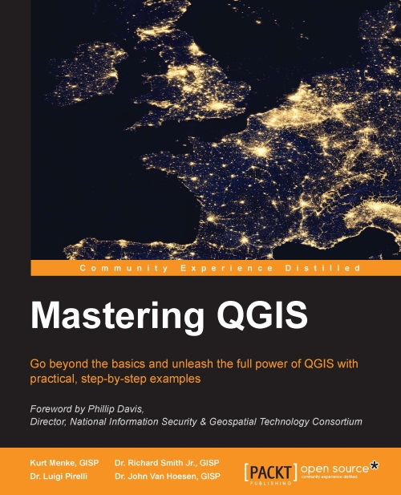

# Mastering QIS

* **Publisher** https://www.packtpub.com/application-development/mastering-qgis  

<!-- toc orderedList:0 depthFrom:1 depthTo:6 -->

- [Mastering QIS]()
	- [Chapter 1: A Refreshing Look at QGIS](Ch01_A_Refreshing_Look_at_QGIS.md)
	- [Chapter 2: Creating Spatial Databases](Ch02_Creating_Spatial_Databases.md)
	- [Chapter 3: Styling Raster and Vector Data](Ch03_Styling_Raster_and_Vector_Data.md)
	- [Chapter 4: Preparing Vector Data for Processing](Ch04_Preparing_Vector_Data_for_Processing.md)
	- [Chapter 5: Preparing Raster Data for Processing](Ch05_Preparing_Raster_Data_for_Processing.md)
	- [Chapter 6: Advanced Data Creation and Editing](Ch06_Advanced_Data_Creation_and_Editing.md)
	- [Chapter 7: The Processing Toolbox](Ch07_The_Processing_Toolbox.md)
	- [Chapter 8: Automating Workflows with the Graphical Modeler](Ch08_Automating_Workflws_with_the_Graphical_Modeler.md)
	- [Chapter 9: Creating QGIS Plugins with PyQGIS and Problem Solving](Ch09_Creating_QGIS_Plugins_with_PyQGIS_and_Problem_Solving.md)
	- [Chapter 10: PyQGIS Scripting](Ch10_PyQGIS_Scripting.md)

<!-- tocstop -->

## Chapter 1: A Refreshing Look at QGIS  
* QGIS download and installation  
  * Installing QGIS on Windows  
  * Installing QGIS on Mac OS X  
  * Installing QGIS on Ubuntu Linux  
    * Installing QGIS only  
    * Installing QGIS and other FOSSGIS Packages  
* Tour of QGIS  
  * QGIS Desktop  
  * QGIS Browser  
* Loading data  
  * Loading vector data  
  * Loading raster data  
  * Loading databases  
  * Web services  
* Working with coordinate reference systems  
* Working with tables  
  * Table joins  
* Editing data  
  * Snapping  
  * Styling vector data  
  * Styling raster data  
  * Contrast enhancement  
  * Blending modes  
* Composing maps  
* Adding functionality with plugins  
* Summary  

## Chapter 2: Creating Spatial Databases  
* Fundamental database concepts  
  * Database tables  
  * Table relationships  
  * Structured Query Language  
* Creating a spatial database  
* Importing data into a SpatiaLite database  
  * Importing KML into SpatiaLite  
  * Importing a shapefile into SpatiaLite  
  * Importing tables into SpatiaLite  
* Exporting tables out of SpatiaLite as a shapefile  
* Managing tables  
  * Creating a new table  
  * Renaming a table  
  * Editing table properties  
  * Deleting a table  
  * Emptying a table  
* Creating queries and views  
  * Creating a SQL query  
  * Creating a spatial view  
  * Dropping a spatial view  
* Summary  

## Chapter 3: Styling Raster and Vector Data  
* Choosing and managing colors  
  * Always available color picker components  
  * Changeable panels in color picker  
    * Color Ramp  
    * Color wheel  
    * Color swatches  
    * Color sampler  
* Managing color ramps  
  * Managing the QGIS color ramp collection  
    * Renaming a color ramp  
    * Removing a color ramp  
    * Exporting a color ramp  
    * Importing a color ramp  
    * Adding a color ramp  
    * Editing a color ramp  
* Styling single band rasters  
  * Paletted raster band rendering  
  * Singleband gray raster band rendering  
  * Singleband pseudocolor raster band rendering  
* Styling multiband rasters  
* Creating a raster composite  
* Raster color rendering  
* Raster resampling  
* Styling vectors  
  * Single-symbol vector styling  
  * Categorized vector styling  
  * Graduated vector styling  
  * Rule-based vector styling  
  * Point-displacement vector styling  
  * Inverted polygons vector styling  
* Vector layer rendering  
* Using diagrams to display thematic data  
  * Parameters common to all diagram types  
    * Diagram size parameters  
    * Diagram position parameters  
    * Adding attributes to diagrams  
  * Creating a pie chart diagram  
  * Creating a text chart diagram  
  * Creating a histogram chart diagram  
* Saving, loading, and setting default styles  
  * Saving a style  
  * Loading a style  
  * Setting and restoring a default style  
* Summary  

## Chapter 4: Preparing Vector Data for Processing  
* Merging shapefiles  
* Creating spatial indices  
* Checking for geometry errors  
* Converting vector geometries  
  * Creating polygon centroids  
  * Converting polygons to lines and lines to polygons  
  * Creating polygons surrounding individual points  
  * Extracting nodes from lines and polygons  
  * Simplifying and densifying features  
  * Converting between multipart and singlepart features  
  * Adding geometry columns to  
attribute table  
* Using basic vector geoprocessing tools  
  * Spatial overlay tools  
    * Using the Clip and Difference tools  
    * Using the Intersect and  
Difference tools  
    * Overlaying polygon layers with Union  
  * Creating buffers  
  * Generating convex hulls  
  * Dissolving features  
* Defining coordinate reference systems  
  * Understanding the Proj.4 definition format  
  * Defining a new custom coordinate reference system  
* Advanced field calculations  
  * Exploring the field calculator interface  
  * Writing advanced field calculations  
    * The first example – calculating and formatting current date  
    * The second example – inserting geometry values  
    * The third example – calculating a population-dependent label string  
* Complex spatial and aspatial queries  
* Summary  

## Chapter 5: Preparing Raster Data for Processing  
* Reclassifying rasters  
  * Converting datasets from floating point  
integer rasters  
  * Resampling rasters  
    * Installing and troubleshooting SAGA  
different platforms  
* Rescaling rasters  
* Creating a raster mosaic  
* Generating raster overviews (pyramids  
* Converting between raster and vector data models  
  * Converting from raster to vector  
  * Converting from vector to raster (rasterize  
* Creating raster surfaces via interpolation  
* Summary  

## Chapter 6: Advanced Data Creation and Editing  
* Creating points from coordinate data  
  * Mapping well-known text  
of geometry  
* Geocoding address-based data  
  * How address geocoding works  
  * The first example – geocoding using web services  
  * The second example – geocoding using local street network data  
* Georeferencing imagery  
  * Ground control points  
  * Using the Georeferencer GDAL plugin  
  * The first example – georeferencing using a second dataset  
    * Getting started  
    * Entering ground control points  
    * Transformation settings  
    * Completing the operation  
  * The second example – georeferencing  
a point file  
* Checking the topology of vector data  
  * Installing the topology checker  
  * Topological rules  
    * Rules for point features  
    * Rules for line features  
    * Rules for polygon features  
  * Using the Topology Checker  
* Repairing topological errors via topological editing  
  * Example 1 – resolving duplicate geometries  
  * Example 2 – repairing overlaps  
    * Setting the editing parameters  
    * Repairing an overlap between polygons  
  * Example 3 – repairing a gap between polygons  
* Summary  

## Chapter 7: The Processing Toolbox  
* About the processing toolbox  
  * Configuring the processing toolbox  
  * Understanding the processing toolbox  
  * Using the processing toolbox  
* Performing raster analyses with GRASS  
  * Calculating shaded relief  
  * Calculating least-cost path  
    * Calculating slope using r.slope  
    * Reclassifying new slope raster and the land use raster  
    * Combining reclassified slope and land use layers  
    * Calculating cumulative cost raster using r.cost  
    * Calculating cost path using least-cost paths  
  * Evaluating a viewshed  
    * Clipping elevation to the boundary of the park using GDAL  
    * Calculating viewsheds for towers using r.viewshed  
    * Combining viewsheds using r.mapcalculator  
    * Calculating raster statistics using r.stats  
* SAGA  
  * Evaluating a habitat  
    * Calculating elevation ranges using the SAGA Raster calculator  
    * Clipping land use to the park boundary using Clip grid with polygon  
    * Querying land use for only surface water using SAGA Raster calculator  
    * Finding proximity to surface water using GDAL Proximity  
    * Querying the proximity for 1,000 meters of water using GDAL Raster calculator  
    * Reclassifying land use using the Reclassify grid values tool  
    * Combining raster layers using SAGA Raster calculator  
* Exploring hydrologic analyses with TauDEM  
  * Removing pits from the DEM  
  * Calculating flow directions across the landscape  
  * Calculating the upstream area above Fort Klamath  
  * Calculating a stream network raster grid  
  * Creating a watershed-specific vector stream network  
* R  
  * Exploring summary statistics and histograms  
* Summary  

## Chapter 8: Automating Workflows with the Graphical Modeler  
* An introduction to the graphical modeler  
* Opening the graphical modeler  
* Configuring the modeler and  
a model  
* Adding inputs  
* Adding algorithms  
* Running a model  
* Editing a model  
* Documenting a model  
* Saving, loading, and exporting models  
* Executing model algorithms iteratively  
* Nesting models  
* Using batch processing with models  
* Converting a model into a Python script  
* Summary  

## Chapter 9: Creating QGIS Plugins with PyQGIS and Problem Solving  
* Webography - where to get API information and PyQGIS help  
  * PyQGIS cookbook  
  * API documentation  
  * The QGIS community, mailing lists, and IRC channel  
    * Mailing lists  
    * IRC channel  
    * The StackExchange Community  
    * Sharing your knowledge and reporting issues  
* The Python Console  
  * Getting sample data  
  * My first PyQGIS code snippet  
  * My second PyQGIS code snippet – looping the layer features  
* Exploring iface and QGis  
* Exploring a QGIS API in the Python Console  
* Creating a plugin structure with Plugin Builder  
  * Installing Plugin Builder  
  * Locating plugins  
  * Creating my first Python plugin – TestPlugin  
    * Setting mandatory plugin parameters  
    * Setting optional plugin parameters  
    * Generating the plugin code  
    * Compiling the icon resource  
    * Plugin file structure – where and what to customize  
* A simple plugin example  
  * Adding basic logic to TestPlugin  
    * Modifying the layout with Qt Designer  
    * Modifying GUI logic  
    * Modifying plugin logic  
* Setting up a debugging environment  
  * What is a debugger  
  * Installing Aptana  
  * Setting up PYTHONPATH  
  * Starting the Pydevd server  
  * Connecting QGIS to the Pydevd server  
* Debugging session example  
  * Creating a PyDev project for TestPlugin  
  * Adding breakpoints  
  * Debugging in action  
* Summary  

## Chapter 10: PyQGIS Scripting  
* Where to learn Python basics  
  * Tabs or spaces, make your choice  
* Loading layers  
  * Managing rasters  
    * Exploring QgsRasterLayer  
    * Visualizing the layer  
  * Managing vector files  
  * Managing database vectors  
* Vector structure  
  * The basic vector methods  
  * Describing the vector structure  
    * Describing the header  
    * Describing the rows  
* Iterating over features  
  * Describing the iterators  
* Editing features  
  * Update canvas and symbology  
  * Editing through QgsVectorDataProvider  
    * Changing a feature's geometry  
    * Deleting a feature  
    * Adding a feature  
  * Editing using QgsVectorLayer  
    * Discovering the QgsVectorLayerEditBuffer class  
    * Changing a feature's attributes  
    * Adding and removing a feature  
* Running processing toolbox algorithms  
  * Looking for an algorithm  
  * Getting algorithm information  
  * Running algorithms from the console  
  * Running your own processing script  
    * Creating a test processing toolbox script  
    * Looking at the custom script  
    * Running the script  
* Running an external algorithm or command  
  * Running a simple command  
* Interacting with the map canvas  
  * Getting the map canvas  
  * Explaining Map Tools  
  * Setting the current Map Tool  
  * Getting point-click values  
    * Getting current Map Tool  
    * Creating the new Map Tool  
    * Creating a map canvas event handler  
    * Creating a Map Tool event handler  
    * Setting up the new Map Tool  
  * Using point-click values  
  * Exploring the QgsRubberBand class  
* Summary  
