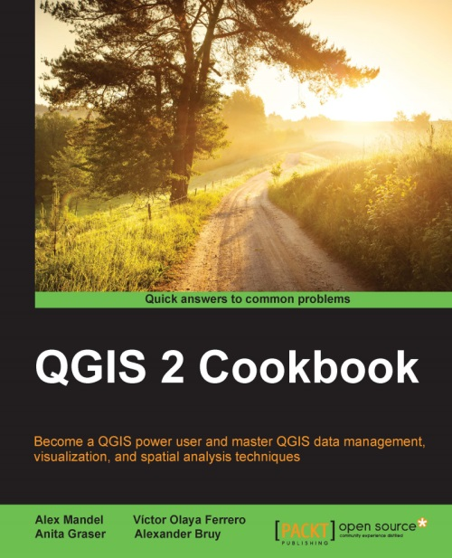

# Mastering QIS

* **Publisher** https://www.packtpub.com/application-development/mastering-qgis  

## Toc
* [Ch01 Data Input and Output](Ch01_Data_Input_and_Output.md)  
* [Ch02 Data Management](Ch02_Data_Management.md)  
* [Ch03 Common Data Preprocessing](Ch03_Common_Data_Preprocessing.md)  
* [Ch04 Data Exploration](Ch04_Data_Exploration.md)  
* [Ch05 Classic Vector Analysis](Ch05_Classic_Vector_Analysis.md)  
* [Ch06 Network Analysis](Ch06_Network_Analysis.md)  
* [Ch07 Classic Raster Analysis](Ch07_Classic_Raster_Analysis.md)  
* [Ch08 Raster Analysis II](Ch08_Raster_Analysis_II.md)  
* [Ch09 QGIS and the Web](Ch09_QGIS_and_the_Web.md)  
* [Ch10 Cartography Tips](Ch10_Cartography_Tips.md)  
* [Ch11 Extending QGIS](Ch11_Extending_QGIS.md)  
* [Ch12 Up and Coming](Ch12_Up_and_Coming.md)  